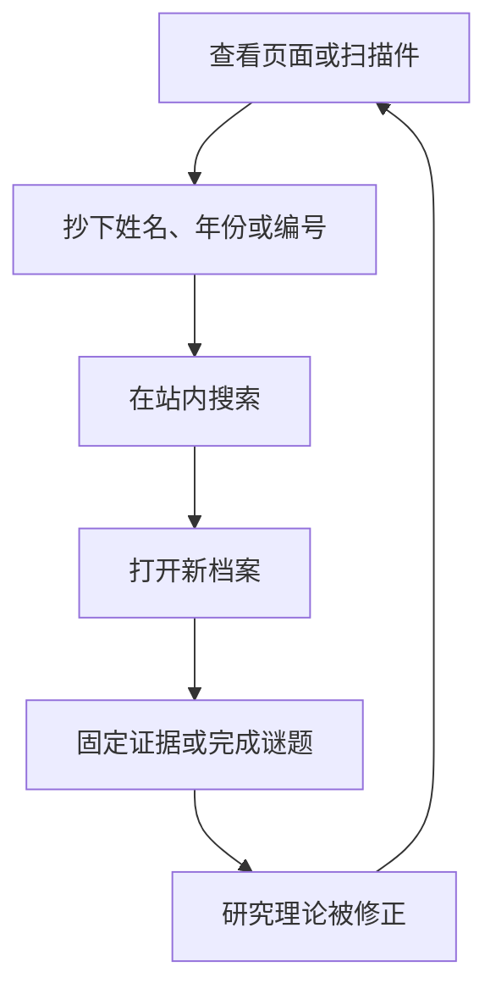
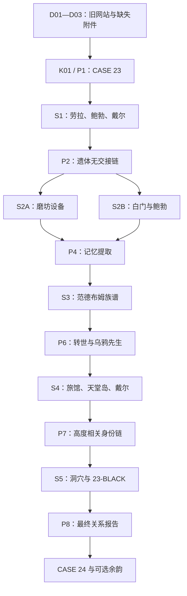
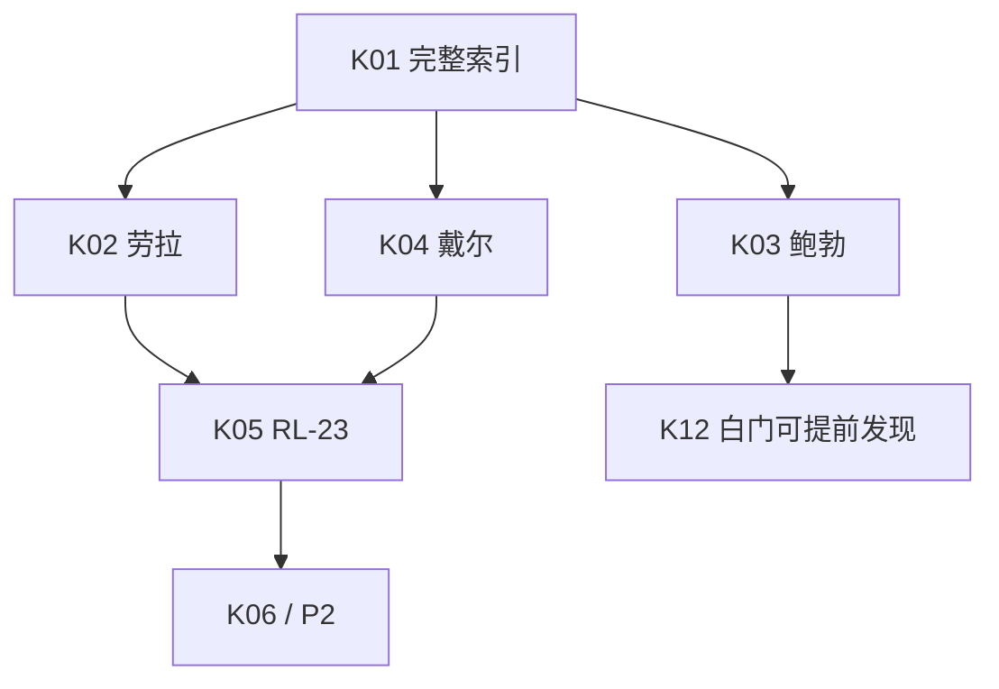

# 《锈湖档案：23号案》完整游戏流程、输入输出与剧情脚本 V1

> 文档性质：从玩家打开网站到完成结局的逐节点制作脚本。  
> 本文不是故事大纲，而是页面、输入、输出、谜题、剧情和状态变化的完整运行流程。  
> 搜索词、别名和解锁门槛如与本文冲突，以 `search-keyword-flow.md` 为准。  
> 原作人物关系和结局如与本文冲突，以 `complete-story.md` 为准。  
> 网页如何实现以 `web-architecture-engineering.md` 为准。  
> 玩家始终是匿名外部调查者；网站不会认识、追踪或选择玩家。

---

# 0. 本文如何使用

后续制作每个页面时，都从本文找到对应节点，并依次落实：

1. 玩家进入节点前知道什么；
2. 哪个页面把输入元素交给玩家；
3. 玩家具体输入或操作什么；
4. 搜索结果页出现什么；
5. 打开结果后页面展示什么；
6. 本页输出哪些新线索；
7. 玩家当前理论发生什么变化；
8. 哪些状态被记录；
9. 下一步从哪里自然产生；
10. 输入错误或玩家停滞时怎样恢复。

不得只制作“看起来很神秘”的页面，却没有明确输入、输出或剧情作用。

---

# 1. 完整体验定义

## 1.1 游戏开始与结束

玩家开始时相信：

> 这是一个在 2008 年停更的地方档案网站。1971 年，一名叫劳拉·范德布姆的女性死亡，
> 前男友可能与案件有关，第六份附件在数字化时遗失。

玩家结束时能够确认：

- 鲍勃不足以解释劳拉之死；
- 劳拉遗体没有现实运输链，却在 1972 年的磨坊材料中出现；
- 磨坊设备从劳拉体内提取白色和黑色记忆；
- 劳拉是威廉·范德布姆转世后获得的独立人生；
- 阿尔道斯成为乌鸦先生；
- 埃兰德家族、旅馆动物客人与戴尔童年兔面案件高度相关；
- 戴尔也被纳入锈湖的记忆测试；
- `23-BLACK` 是互不兼容的死亡记忆索引，而非唯一真相；
- 关系可以被重建，但劳拉之死不适用单一线性因果。

## 1.2 玩家反复进行的动作

## 1.3 游戏规模

| 项目 | 数量 |
|---|---:|
| 主线关键词 | 29 |
| 可选关键词 | 9 |
| 核心档案 | 31 |
| 辅助页面 | 4 |
| 隐藏档案 | 6 |
| 必要谜题 | 8 |
| 目标时长 | 60—90 分钟 |

---

# 2. 故事结构

## 2.1 三幕七章

| 结构节拍 | 游戏节点 | 剧情作用 |
|---|---|---|
| 开场画面 | D01 | 已停止维护的普通旧网站 |
| 诱发事件 | D02 的六缺一附件 | 玩家开始寻找 `23-BLACK` |
| 第一章 | K01 | 学会利用网页内词语搜索 |
| 第二章 | K02—K06、P2 | 鲍勃嫌疑被削弱，遗体凭空消失 |
| 第一幕转折 | D10 | 案件无法用现实运输链解释 |
| 第三章 | K07—K14、P3、P4 | 劳拉出现在磨坊，记忆被提取 |
| 第四章／中点 | K15—K19、P5、P6 | 劳拉是威廉的新生命 |
| 第五章 | K20—K24、P7 | 戴尔也成为锈湖的记忆主体 |
| 第二幕转折 | D28 | 劳拉与戴尔在洞穴设备两端汇合 |
| 第六章／高潮 | K26—K28、P8 | `23-BLACK` 推翻唯一死因框架 |
| 第七章／结局 | K29、D31 | 23 号案结束，24 号案开始 |

## 2.2 三条叙事弧线

| 阶段 | 案件调查线 | 人物情绪线 | 档案项目线 |
|---|---|---|---|
| S0 | 寻找缺失附件 | 劳拉只是一个案名 | 2008 年因版本冲突停更 |
| S1 | 核对死因和时间 | 劳拉恢复为具体的人；鲍勃从嫌疑走向悲伤 | 三版现场图都像原件 |
| S2 | 追踪遗体到磨坊 | 鲍勃成为创伤幸存者 | 技术故障无法解释版本 |
| S3 | 调查范德布姆家族 | 劳拉是转世，但不失去独立人格 | 来源链跨越百年 |
| S4 | 调查旅馆和戴尔 | 戴尔从侦探变成另一名受害者 | 米里亚姆撤回过度确定的文章 |
| S5 | 重建记忆机制 | 劳拉与戴尔成为镜像 | 项目承认“原件可能不唯一” |
| 尾声 | 案件不适用线性因果 | 不拯救、不改写，只理解 | 只读封存保持不变 |

## 2.3 玩家理论

| 理论 | 内容 |
|---|---|
| T0 | 鲍勃可能与劳拉死亡有关 |
| T1 | 鲍勃不足以解释案件；遗体没有现实交接链 |
| T2 | 劳拉的身体在磨坊被用于提取白色与黑色记忆 |
| T3 | 劳拉是威廉的新生命；乌鸦先生是阿尔道斯 |
| T4 | 戴尔也是被重历和测试的记忆主体 |
| T5 | 冲突档案是不同记忆状态，而非普通伪造 |
| T6 | 关系可以确定，但死亡不适用单一线性因果 |

“研究记录”保留所有旧理论，并显示是哪份证据让它被修正。

---

# 3. 玩家输入与系统输出规则

## 3.1 输入类型

| 输入 | 玩家动作 | 系统输出 |
|---|---|---|
| 导航输入 | 点击首页、目录、日志等链接 | 打开公开页面 |
| 搜索输入 | 输入姓名、日期、编号或组合词 | 返回最多 7 条结果 |
| 档案输入 | 点击搜索结果或附件 | 打开完整、占位或冲突档案 |
| 观察输入 | 查看图片版本、OCR、背面或放大细节 | 标记已查看并可能触发秘密 |
| 证据输入 | 点击“固定为证据” | 加入本地证据栏 |
| 排序输入 | 移动时间或流程卡片 | 检查顺序并给反馈 |
| 配对输入 | 选择人物、物件和关系 | 检查对应关系 |
| 等级输入 | 选择原作明确、强烈暗示等 | 判断结论是否过度 |
| 报告输入 | 提交关系、两份证据和等级 | 完成最终调查表 |

## 3.2 搜索成功时

搜索不会直接把玩家传送到档案正文。

顺序是：

1. 玩家提交搜索；
2. 搜索结果页出现目标卡和少量合理环境结果；
3. 玩家点击目标卡；
4. 档案第一次打开；
5. 新线索才正式记入已见关键词；
6. 档案加入“已发现档案”。

## 3.3 页面四种状态

| 状态 | 玩家看到什么 |
|---|---|
| `hidden` | 搜索不返回该档案 |
| `stub` | 标题、年代、来源和附件未恢复说明 |
| `available` | 完整档案 |
| `conflicted` | 两个或多个互不兼容版本 |

## 3.4 玩家提前知道原作答案

提前猜中后期关键词不会惩罚玩家，但也不能跳过证据：

- 有时返回普通噪声；
- 有时返回 `stub`；
- 不提前显示关键附件正文；
- 不提前完成理论；
- 不绕过 P2—P8。

---

# 4. 主线总图

---

# 5. S0：最后一次公开备份

## S0剧情目标

- 建立“普通旧档案网站”的可信外壳；
- 先给玩家一个传统死亡案；
- 把 `23-BLACK` 作为贯穿全篇的承诺；
- 教会玩家：网页上出现的明确词语可以搜索。

## S0玩家当前理论

> T0：劳拉可能死于感情纠纷，鲍勃值得调查。

---

## START-01：打开网站

### 玩家输入

打开 `index.html` 或网站首页。

### 首屏出现

网站标题：

> **Rusty Lake Local Records Project**  
> 锈湖地方档案数字化计划

页面组成：

- 低清湖景横幅；
- 2008 年 10 月的静态天气栏；
- 固定访客计数器；
- 图书馆搬迁旧通知；
- “本周档案”；
- 扫描志愿者名单；
- 项目介绍；
- 2008 年停更公告。

### D01：停更首页正文

停更公告核心文字：

> 由于部分资料来源无法核实，且数据库中的同一文件开始出现多个互不兼容的版本，
> 本项目暂停新增与推断。现有页面以最后一次公开备份形式保留。

页脚：

- 项目负责人：Miriam Hart；
- 网页与扫描：Daniel Moor；
- 最后更新：2008；
- 状态：只读；
- 不出现“网站正在观察访问者”。

### 玩家可操作内容

- 点击“本周档案：23 号未结案”；
- 点击项目介绍；
- 点击站内搜索；
- 其他分类只显示普通公开目录。

### 剧情作用

玩家认为停更是普通档案质量问题。“互不兼容版本”是终局概念的第一次无害表达。

---

## START-02：打开 D02 公开摘要

### 玩家输入

点击首页“本周档案”。

### 页面出现

标题：

> **CASE 23 — UNSOLVED**

公开字段：

| 字段 | 内容 |
|---|---|
| 当事人 | Laura Vanderboom |
| 年份 | 1971 |
| 地点 | 锈湖县一处私人住所 |
| 调查人员 | Detective D. Vandermeer |
| 案件状态 | Unsolved |
| 附件数量 | 6 |
| 已定位 | 5 |

附件区只允许打开地方新闻 D03，其余附件显示“尚未公开整理”。

缺失项显示：

> `23-BLACK`  
> 原始目录标记：BLACK  
> 项目注释：可能指黑白底片分类，附件暂缺。

### 页面输出

- `Laura Vanderboom`
- `D. Vandermeer`
- `CASE 23`
- `23-BLACK`
- “附件六件，实际只有五件”

### 当前目标

页面侧栏写：

> 帮助项目组确认原始案件索引。

---

## START-03：打开 D03 地方新闻

### 玩家输入

点击 D02 中唯一可读附件“地方新闻剪报”。

### 页面出现

标题：

> **年轻女子被发现死于住所**

正文必须表达：

- 劳拉于 1971 年秋死亡；
- 报道暗示刚结束的感情关系；
- 前男友正式姓名为 Robert Hill；
- 新闻没有直接证据，只使用“警方正在了解情况”等模糊措辞；
- 发现时间与 D02 摘要存在轻微差异。

剪报底部：

> Police reference: Case 23

### 页面输出

- `Robert Hill`
- `CASE 23`
- 第一个死亡时间版本

### 剧情作用

新闻语言把玩家锚定在“前男友可能涉案”的传统悬疑框架中。

---

## K01 / P1：输入 `CASE 23`

### 输入来源

- D02 红色警察印章；
- D03 剪报底部；
- D02 附件编号。

### 玩家输入

标准：

> `CASE 23`

接受示例：

- `case23`
- `23号案`
- `案件23`
- `RL CASE 23`

单独输入 `23` 只返回普通编号结果，不完成教学。

### 搜索结果出现

首条结果：

> **23 号案完整索引**  
> 来源：锈湖警署公开目录  
> 状态：部分附件缺失

玩家点击后，D02 升级为扩展索引。

### 扩展索引内容

- 附件总数 6、已定位 5；
- Laura Vanderboom；
- Robert Hill；
- Detective Dale Vandermeer；
- 内部档案编号 `RL-23`；
- `23-BLACK` 保持灰色占位。

### 新输入元素

- `Laura Vanderboom`
- `Robert Hill`
- `Dale Vandermeer`
- `RL-23`

### 状态与剧情

- P1 完成；
- 玩家理解搜索规则；
- S1 开放；
- T0 不变；
- 当前问题变为：“这些公开记录为什么给出不同的死亡时间？”

### 错误反馈

- 输入 `23`：
  > 该编号存在多个普通目录，请补充案件类型。
- 连续卡住：
  > 案件编号同时出现在警察印章和新闻页脚。

---

# 6. S1：普通死亡案

## S1结构

K02、K03、K04 可以任意顺序完成。

## S1剧情目标

- 先让鲍勃看起来可疑，再证明只有悲伤和矛盾证词；
- 通过生活材料让劳拉成为一个人；
- 通过戴尔建立可信调查视角；
- 把问题从“谁杀了她”转成“遗体去了哪里”。

---

## K02：输入 `Laura Vanderboom`

### 输入来源

- D02 当事人字段；
- D03 标题和正文；
- K01 完整索引。

### 接受输入

`Laura`、`Laura V`、`Vanderboom Laura`、`劳拉 范德布姆`。

### 搜索结果出现

1. **D04：尸检摘要**
2. **D07：劳拉生活材料**

两条目标结果都在首屏。

### D04 页面内容

元数据：

- 年份：1971；
- 来源：警署医疗公开摘要；
- 批次：`RL-23`；
- 发现时间与新闻不一致。

正文：

- 没有确定唯一死因；
- 眼部存在异常黑色沉积；
- 原始附件缺少部分页；
- 项目组把黑色沉积暂时解释为底片或扫描损伤。

### D07 页面内容

- 劳拉未完成的湖景画；
- 与 Harvey 的生活照片；
- 写给 Bob 但没有寄出的便笺；
- 便笺表达她想结束一段让双方都痛苦的关系；
- 她害怕一个反复出现的梦；
- 照片背面保留 1971 年和住所编号。

便笺不做世界观说明，只呈现生活细节。

### 新输入元素

- `Bob Hill`
- `Harvey`
- `RL-23`
- 第二个发现时间版本

### 剧情变化

劳拉不再只是报纸中的尸体。玩家开始意识到“她想离开这段关系”不等于“鲍勃杀了她”。

### 状态

- D04、D07 加入已发现档案；
- T0 第一次受到削弱；
- O01 `HARVEY` 可以得到早期人物索引，但内容尚不完整。

---

## K03：输入 `Robert Hill`

### 输入来源

- K01 完整索引；
- D03 正式姓名；
- D07 私人称呼 Bob。

### 接受输入

`Bob Hill`、`Robert`、`Bob`、`罗伯特 希尔`、`鲍勃`。

### 搜索结果出现

> **D05：Robert Hill 询问记录**

### D05 页面内容

记录必须包含：

- 鲍勃承认两人已经分手；
- 他最后一次通话的时间与新闻版本冲突；
- 他情绪失控、部分回答断裂；
- 没有门禁、目击或物证证明他进入劳拉住所；
- 他能准确说出劳拉的作画习惯，与 D07 相互验证；
- 1972 年福利跟进章；
- 路由章：`WHITE DOOR / INTAKE REVIEW`。

项目组注释：

> 该记录足以证明当事人受到严重打击，不足以证明其进入现场。

### 新输入元素

- `White Door`
- `1972`
- 最后通话时间

### 剧情变化

鲍勃仍然可疑，但“可疑”只来自情绪和报道框架，不来自实际证据。

### 状态

- D05 加入已发现档案；
- K12 可以提前搜索；
- K13 的姓名与年份已经出现，但尚未明确要求组合。

---

## K04：输入 `Dale Vandermeer`

### 输入来源

- K01 办案人员字段；
- D02 调查负责人；
- D03 照片说明。

### 接受输入

`D. Vandermeer`、`Detective Vandermeer`、`Vandermeer Dale`、`戴尔 范德米尔`。

### 搜索结果出现

> **D06：戴尔·范德米尔办案便笺**

### D06 页面内容

便笺主体：

1. 邻居报警；
2. 戴尔进入住所；
3. 现场被封闭；
4. 遗体确认不在现场。

纸面细节：

- 右上角 `RL-23`；
- 纸角反复出现方形涂鸦；
- 人事摘要提到 1939 年受限家庭案件；
- 一张被裁掉大半的机器草图只剩 `C-4`；
- 戴尔没有写超自然结论，只记录观察事实。

### 新输入元素

- `RL-23`
- `1939`
- 方形符号
- `C-4`

### 剧情变化

戴尔成为玩家信任的专业视角。1939 与机器草图暂时像无关的人事附件。

### 状态

- D06 加入已发现档案；
- K05 开放；
- K21 提前搜索只返回受限家庭记录占位。

---

## K05：输入 `RL-23`

### 输入来源

- D04 页脚；
- D06 右上角；
- K01 内部编号字段。

### 接受输入

`RL23`、`RL 23`、`R.L.23`。

### 搜索结果出现

> **D08：RL-23 现场照片批次**

结果卡标注：

> 同一目录存在 3 个恢复版本。

### D08 页面内容

版本：

1. 2003 扫描版；
2. 2005 备份版；
3. 2007 恢复版。

三版拥有相同案件编号和 1971 原始年份，但：

- Harvey 的位置不同；
- 劳拉身体朝向不同；
- 窗外光线不同；
- 黑色斑点的位置不同。

版本栏另有：

> 1972 跨索引：附件未恢复。

米里亚姆注释：

> 三份文件都能追溯到同一批次，现阶段不选择“主版本”，全部保留。

### 新输入元素

- `RL-23 1971`
- `RL-23 1972`
- `Harvey`

### 剧情变化

玩家第一次面对不能用“扫描质量不同”完全解释的冲突，但仍可能认为是人为篡改。

### 状态

- D08 加入已发现档案；
- K06 开放；
- O01、O03 获得部分来源；
- 查看三个版本中的 Harvey 位置，为 `secret_harvey` 计数。

---

## K06：输入 `RL-23 1971`

### 输入来源

- D08 原始年份；
- D03、D04 的 1971；
- D04、D06 的 `RL-23`。

### 接受输入

`1971 RL-23`、`RL23 1971`、`CASE 23 1971`。

### 搜索结果出现

> **D09：1971 现场补充报告**

同时出现：

> **P2：重建现场时间线**

### D09 页面内容

- 停电持续约 47 秒；
- 证人描述黑色飞蛾；
- 原文存在“物体向上移动”；
- 后来版本划掉了这句话；
- 报告时间与 D06 四个节点对应；
- 项目组将证人描述标为“受惊后的不可靠陈述”。

### 新输入元素

- `BLACK MOTHS`
- `RL-23 1972`
- “向上移动”

---

## P2：现场时间线

### 出现条件

- K02—K06 已完成；
- 玩家能够查看 D05、D06、D09。

### 页面指令

> 将已记录的四个事件按先后排列。不要添加档案中没有出现的步骤。

### 玩家输入

排序卡片：

1. 邻居报警；
2. 戴尔进入住所；
3. 现场被封闭；
4. 遗体确认不在现场。

同时固定：

- D05 最后通话；
- D06 办案时间；
- D09 停电与补充报告。

### 正确输出

页面盖章：

> **时间线成立。保管过程无法成立。**

随后开放 D10。

### 错误输出

- 把遗体消失放在封闭前：
  > 时间本身正确，但现场尚未封闭。
- 加入“运输车辆”：
  > 档案中没有运输步骤，请只使用已记录事件。
- 遗漏停电相关报告：
  > 时间线仍缺一份现场补充材料。

### D10 页面内容

标题：

> **遗体保管链审计**

检查结果：

- 无尸体交接；
- 无运输车辆；
- 无停尸房入库；
- 无警局移交；
- 唯一跨年份索引：`RL-23 / 1972 / maintenance`。

关键结论：

> 没有一份现实记录能说明遗体如何离开封闭现场。

### 阶段剧情收束

玩家的理论从：

> 鲍勃可能杀死了劳拉。

变为：

> 鲍勃不足以解释案件。真正异常的是，一具被记录在封闭现场的遗体没有任何离开过程。

### 状态

- P2 完成；
- D10 加入已发现档案；
- T1 生效；
- K07 开放；
- S1 完成。

---

# 7. S2：没有运输过程的目的地

## S2结构

本阶段有两条并行路线。

### 磨坊路线

`K07 → K08/K09/K10 → P3 → K11 → P4`

### 鲍勃路线

`K12 → K13 → K14`

两条路线全部完成后，才开放 1859 年家族记录。

## S2剧情目标

- 用电视和时钟保留原作的超自然转移断裂；
- 不虚构运输车辆或秘密组织；
- 把白黑方块从“图形”改写为“记忆输出”；
- 让鲍勃从嫌疑人彻底转为创伤幸存者；
- 通过 `A. Vanderboom` 把 1972 年连向 1859 年。

---

## K07：输入 `RL-23 1972`

### 输入来源

- D10 跨年份索引；
- D08 的 1972 占位；
- D05 的 1972 跟进作为辅助。

### 接受输入

`1972 RL-23`、`RL23 1972`、`CASE 23 1972`。

### 搜索结果出现

> **D11：1972 年设备维修包——电视静帧**

### D11 页面内容

画面：

- 一台旧电视；
- 屏幕中出现与劳拉现场照片一致的人影；
- 屏幕边缘写有 `CASE 23`；
- 电视旁时钟的外壳写 `CW-6`；
- 设备区号 `M-138.4`；
- 客户栏残留 `A. VDB`；
- 地点暂记为 `Rusty Lake Mill?`。

项目组注释：

> 可能是维修人员误用旧底片进行测试，但尚无法解释纸质照片的年代。

### 新输入元素

- `M-138.4`
- `CW-6`
- `A. Vanderboom`
- `Rusty Lake Mill`

### 剧情变化

1971 年的遗体图像在 1972 年磨坊材料中出现。玩家暂时认为某个机构进行了非法处理。

---

## K08：输入 `M-138.4`

### 来源

D11 设备标签与 OCR。

### 接受输入

`M138.4`、`M 138.4`、`138.4`。

### 搜索结果

> **D13：磨坊电力故障单**

### 页面内容

- 地点正式确认为 Rusty Lake Mill；
- 1972 年出现异常瞬时高负荷；
- 电力曲线有四个峰值；
- 客户账户 `A. VDB`；
- 设备 `RLM-X4`；
- 维修备注要求校准 `CW-6`。

### 新输入元素

- `RLM-X4`
- `CW-6`
- `A. Vanderboom`
- 四段峰值顺序

### 剧情与状态

- D13 加入档案；
- P3 获得地点证据；
- P4 获得流程时间。

---

## K09：输入 `CW-6`

### 来源

D11 时钟外壳与 D13 维修备注。

### 接受输入

`CW6`、`CW 6`、`CLOCK CW-6`。

### 搜索结果

> **D14：CW-6 时钟校准单**

### 页面内容

- 校准时间与电视静帧同步；
- 时钟接入 `RLM-X4`；
- 步骤中出现“接收对象”和“完成分离”；
- 边缘出现白色、黑色方格；
- 18:20 有一个被覆盖的历史版本。

### 新输入元素

- `RLM-X4`
- `WHITE`
- `BLACK`
- `CW-6 18:20`

### 状态

- D14 加入档案；
- P3 获得时间同步证据；
- O03 开放。

---

## K10：输入 `A. Vanderboom`

### 来源

D11 客户缩写与 D13 账户名。

### 接受输入

`A Vanderboom`、`A VDB`、`Vanderboom A`、`阿尔道斯 范德布姆`。

此时即使输入阿尔道斯全名，也只返回缩写记录。

### 搜索结果

> **D12：锈湖磨坊房产卡**

### 页面内容

- 管理人长期登记为 `A. Vanderboom`；
- 年龄和登记年代无法由正常寿命解释；
- 房产卡关联 1859 年旧登记；
- 背面有盒号 `VDB-TREE`，但扫描不清；
- 米里亚姆推测可能是多名同名继承人。

### 新输入元素

- `A. Vanderboom 1859`
- `VDB-TREE`
- “管理人年龄不可能”

### 状态

- D12 加入档案；
- P3 地点管理证据完整；
- K15 在 P4 前仍为占位。

---

## P3：确认磨坊关联

### 出现条件

D11、D12、D13、D14 全部发现。

### 玩家输入

从证据栏提交：

1. D11：电视中的劳拉；
2. D13：磨坊地点与区号；
3. D14：同步时间。

### 玩家选择结论

正确：

> 1972 年维修材料来自锈湖磨坊，并与 23 号案中的劳拉相关；
> 但档案中仍不存在现实运输过程。

### 错误反馈

- 选择“遗体由车辆运到磨坊”：
  > 地点关联成立，但运输方式没有任何记录支持。
- 只选 D11：
  > 图像相似不足以确认地点和时间。
- 只选电力、时钟：
  > 设备关联成立，但尚未连接到 23 号案当事人。

### 完成输出

- P3 完成；
- K11 从 `stub` 变为 `available`。

---

## K11：输入 `RLM-X4`

### 来源

D13 设备栏、D14 校准对象、P3 关联报告。

### 接受输入

`RLMX4`、`RLM X4`、`X4 MILL`。

### P3 完成前

只显示：

> 设备图纸存在，但维修地点和案件来源尚未建立。

### P3 完成后搜索结果

1. **D15：提取器维修图**
2. **D16：鸟首人物照片**
3. **P4：恢复设备流程**

### D15 页面内容

- 电视、时钟、人体固定架、头部管线、两个输出槽相连；
- 四个步骤被打乱；
- 两个输出槽标为 `WHITE` 和 `BLACK`；
- 图纸不直接写“记忆方块”；
- 箭头和管线编号为 P4 提供证据。

### D16 页面内容

- 鸟首人物站在设备旁；
- 劳拉身体连接黑色输出槽；
- 边缘写 `A.VDB`；
- 项目组将鸟首解释为防护面具或庆典服饰；
- 玩家可以怀疑人物身份，但当前不能确认乌鸦先生。

### 新输入元素

- `WHITE`
- `BLACK`
- `A.VDB`
- 提取流程

---

## P4：恢复提取流程

### 玩家输入

根据 D13 峰值、D14 校准步骤、D15 箭头排序：

1. 对象在电视与时钟系统中出现；
2. 对象头部接入机器；
3. 设备分离两类输出；
4. 输出被保存到白色和黑色槽位。

### 正确输出

维修图恢复，白黑方格短暂对齐。

页面结论：

> 设备不是普通磨坊机器。它在将与对象有关的两类内容分离并储存。

随后研究记录结合白门线，将其命名为“记忆”。

### 错误反馈

- 储存放在分离前：
  > 输出槽尚未获得任何内容。
- 忽略时钟：
  > 对象出现与电力启动之间仍缺少同步步骤。
- 只依据图形强行排列：
  > 图纸箭头不足，请对照电力峰值和校准单。

### 状态

- P4 完成；
- D15、D16 完整发现；
- T2 等待 K14 汇合确认。

---

## K12：输入 `White Door`

### 来源

D05 路由章与福利跟进。

### 接受输入

`The White Door`、`白门`、`白门机构`。

### 搜索结果

> **D17：白门心理健康与日常康复中心**

### D17 页面内容

公开宣传：

- 规律作息；
- 创伤康复；
- 记忆障碍治疗；
- 病人记录按“姓名＋入院年份”查询。

样例字段：

- `memory`
- `routine`
- `state`

白门页面不能直接解释锈湖或方块。

### 新输入元素

- `Robert Hill 1972`
- `MEMORY`
- `STATE`

### 状态

- D17 加入档案；
- K13 开放。

---

## K13：输入 `Robert Hill 1972`

### 来源

- D05 姓名和 1972 跟进；
- D17 组合检索说明。

### 接受输入

`Bob Hill 1972`、`1972 Bob`、`鲍勃 1972`、`Robert 1972`。

### 搜索结果

> **D18：鲍勃日程与记忆表**

### D18 页面内容

按日程排列：

- 鲍勃记得劳拉画过的湖；
- 他记得自己失去她，却记不清最后一次对话；
- Harvey 被表格归类为“普通鸟类”；
- 记忆项目 6 与劳拉相关；
- 状态栏出现 `BLACK STATE`；
- 后期表格中 Laura 的姓名逐渐变为空白；
- “恢复正常”与“减少劳拉相关记忆”同时发生。

情感文字必须具体而克制：

> 他记得她总是先画湖的边缘。  
> 他不再记得她最后一次叫他的名字。

### 新输入元素

- `BLACK STATE`
- `Harvey`
- “治疗可能同时意味着删除”

### 剧情变化

鲍勃从误导嫌疑人变成创伤幸存者。他确实爱过劳拉，但正在失去关于她的具体记忆。

---

## K14：输入 `BLACK STATE`

### 来源

- D18 状态栏；
- D15 黑色输出；
- D14 黑色方格。

### 接受输入

`BLACK-STATE`、`STATE BLACK`、`黑色状态`、`BLACK MEMORY`。

### 搜索结果

> **黑色分类交叉索引**

页面显示：

- 白门 `BLACK STATE` 和磨坊 `BLACK` 输出使用相同方形标记；
- `23-BLACK` 条目存在，但仍是 `stub`；
- 最后引用位置为洞穴分类残页；
- 1859 年 `A. Vanderboom` 关联记录；
- “BLACK”不再被解释为黑白底片。

### 条件分支

如果 P4 未完成：

- 只显示白门结果；
- `23-BLACK` 保持占位；
- 1859 文件不开放。

如果 P4 已完成且 D18 已读：

- 白门和磨坊两线汇合；
- K15 完整开放；
- T2 确认。

### 阶段剧情收束

玩家得到结论：

> 劳拉的身体在磨坊被用于分离白色与黑色记忆。鲍勃后来也进入了一套以
> “记忆”和“状态”为字段的处理体系。

### 状态

- S2 完成；
- T2 生效；
- K15 开放。

---

# 8. S3：死者出生之前

## S3剧情目标

- 从 1972 年回到 1859 年；
- 让玩家先怀疑家族遗传或身份伪造；
- 通过族谱和灵药谜题确认转世；
- 确认乌鸦先生是阿尔道斯；
- 同时强调劳拉不是“只有威廉”的空壳。

---

## K15：输入 `A. Vanderboom 1859`

### 来源

D12 的 1859 交叉登记与 K14 结果。

### 接受输入

`1859 A Vanderboom`、`A VDB 1859`、`Aldous 1859`、`阿尔道斯 1859`。

### 搜索结果

> **D19：1859 年死亡与遗产登记**

### D19 页面内容

- William Vanderboom 于 1859 年死亡；
- Aldous Vanderboom 是共同实验者；
- Aldous 之后从公共记录消失；
- 遗产清单出现 `Life and Death`；
- 文件来源盒 `VDB-TREE`；
- 不能在本页直接写 Aldous 等于 Mr. Crow。

### 新输入元素

- `William Vanderboom`
- `Aldous Vanderboom`
- `Elixir Life Death`
- `VDB-TREE`

### 剧情变化

`A. Vanderboom` 不再像一个普通同名管理人。调查从一宗 1971 年案件扩展到一百多年前。

---

## K16：输入 `William Vanderboom`

### 来源

D19 死亡登记与遗产清单。

### 接受输入

`William`、`W. Vanderboom`、`Vanderboom William`、`威廉 范德布姆`。

### 搜索结果

> **William Vanderboom 人物卷**

### 页面内容

- 1859 死亡；
- 威廉肖像；
- 与劳拉照片高度相似；
- 一张腐化剪影被当作损坏图像；
- 指向 `VDB-TREE`；
- D21 族谱仍是 `stub`。

项目组注释：

> 肖像可能被误标，也可能只是家族相貌相似。

### 新输入元素

- `VDB-TREE`
- 威廉／劳拉肖像相似

### 剧情变化

玩家先形成“遗传或伪造照片”的现实解释，转世尚未确认。

---

## K17：输入 `Elixir Life Death`

### 来源

D19 遗产清单与边缘炼金分类。

### 接受输入

`Life and Death`、`Elixir of Life and Death`、`生命与死亡灵药`、`生死灵药`。

### 搜索结果

> **D20：生命与死亡灵药残页**

### 页面内容

- 两只杯子；
- 一人死亡；
- 一人获得长生；
- William 与 Aldous 的结果标签错位；
- 乌鸦剪影；
- 页脚 `Samsara`；
- 仅靠本页不能确定谁得到哪个结果。

### 新输入元素

- `Samsara`
- 乌鸦剪影
- 生死交换

### 状态

- D20 加入档案；
- P6 得到第一组证据，但尚未开放。

---

## K18：输入 `VDB-TREE`

### 来源

D12 背面、D19 来源盒、K16 人物卷。

### 接受输入

`VDB TREE`、`VDBTREE`、`Vanderboom Tree`、`范德布姆族谱`。

### 搜索结果

> **D21：范德布姆家族捐赠族谱**

同时开放 P5。

### D21 初始页面

族谱卡片被水损和错误装订打乱。页面提供：

- 出生记录；
- 婚姻记录；
- 遗产记录；
- 子女记录；
- Rose 的未归档材料；
- 1935 年空白出生节点；
- 树根下方的 William 姓名。

---

## P5：重建范德布姆族谱

### 玩家输入

将人物卡放入关系槽位。

核心正确结构：

1. William 与 Aldous 为兄弟；
2. James 继承 William 留下的房产；
3. James 与 Mary 的子女为 Samuel、Emma、Albert；
4. Emma 的子女为 Frank；
5. Samuel 与 Ida 的子女为 Leonard；
6. Albert 与 Ida 的血缘记录指向 Rose；
7. Rose 的下一代为 1935 年出生的 Laura；
8. William 不放在 Laura 的普通父系槽，而放在族谱根部的“复生对象”位置。

### 谜题证据

- D19 遗产与死亡记录；
- D21 出生、婚姻和子女卡；
- William 与 Laura 肖像；
- Rose 材料目录；
- 1935 空白节点。

### 正确输出

- 树根连接到 William；
- 1935 空白节点显示 Laura；
- Rose 材料目录恢复；
- 族谱底部显现 `Samsara`。

页面结论不直接写“转世”，只写：

> 该族谱的仪式记录并非为了延续财产，而是在维持一个指向 William 的复生过程。

### 错误反馈

- 把 William 放成 Laura 父亲：
  > 年代与父母记录不成立。检查树根中的仪式字段。
- 错置 Emma、Samuel、Albert：
  > 该出生记录属于 James 与 Mary 的同一代子女。
- 错置 Rose：
  > 该节点同时需要满足血缘记录与后续仪式材料。

### 状态

- P5 完成；
- K19 开放。

---

## K19：输入 `Samsara 1935`

### 来源

- P5 完成后的族谱；
- D20 页脚；
- Rose 目录；
- Laura 1935 出生节点。

### 接受输入

`1935 Samsara`、`Rose 1935`、`Rose Vanderboom 1935`、`轮回 1935`、`劳拉 1935`。

单独输入 `Samsara` 只返回普通宗教与未分类记录。

### 搜索结果

> **D22：Rose 与 Samsara 材料**

同时开放 P6。

### D22 页面内容

- William 的灵魂经过鱼、壁虎、虫、鸟等形态；
- Rose 完成最终仪式；
- 1935 年 Laura 出生；
- William 肖像与 Laura 照片可以叠合；
- 材料将 Laura 称为新生命，而非空壳；
- 文件袋背面夹着 `RLH-1893` 旅馆照片封套。

### 新输入元素

- `RLH-1893`
- William、Aldous、Laura 的三段身份链

---

## P6：生命、死亡与身份交换

### 页面指令

> 根据死亡登记、灵药残页、族谱、Samsara 材料和磨坊照片，
> 为三个人物配对结果与后续身份。

### 玩家输入与正确答案

| 人物 | 1859 结果 | 后续状态 |
|---|---|---|
| William | 饮下灵药后死亡 | 腐化、等待并最终以 Laura 获得新生命 |
| Aldous | 存活并获得长生 | 成为 Mr. Crow |
| Laura | 1935 出生 | William 的转世，同时拥有独立人生 |

### 必须使用的证据

- D19：William 死亡、Aldous 消失；
- D20：一死一生与乌鸦剪影；
- D16：`A.VDB` 鸟首人物；
- D21：跨代复生族谱；
- D22：Samsara 与 1935 出生。

### 正确输出

页面依次显示：

> William died.  
> Aldous remained.  
> Laura lived.

研究记录更新为：

> 劳拉是 William 转世后获得的新生命。她不是一份旧记忆的替代标签，
> 她有自己的画、关系、恐惧和选择。

### 错误反馈

- 将 Aldous 配为死者：
  > 1859 死亡登记与后续磨坊署名冲突。
- 将 Laura 仅标为 William：
  > 灵魂链成立，但该结论删除了 1935—1971 的独立人生。
- 不选择 Mr. Crow：
  > 鸟首照片、A.VDB 署名与灵药结果尚未得到统一解释。

### 状态与剧情

- P6 完成；
- T3 生效；
- `RLH-1893` 封套恢复；
- K20 开放；
- S3 完成。

### 中点反转

案件真正扩展为：

> 参与提取劳拉记忆的乌鸦先生，同时是她前世 William 的兄弟 Aldous。

---

# 9. S4：另一名受害者

## S4剧情目标

- 用旅馆、天堂岛与生日案建立第二条家族循环；
- 让戴尔从可靠侦探变成被调查的人；
- 精确区分“面具对应”与“所有跨年代身份绝对相同”；
- 让 Harvey 成为无台词的跨年代见证者；
- 为洞穴机器提供 `CAVE-4`。

---

## K20：输入 `RLH-1893`

### 来源

D22 恢复后的旅馆照片封套。

### 接受输入

`RLH1893`、`RLH 1893`、`Rusty Lake Hotel 1893`、`锈湖旅馆 1893`。

### 搜索结果

1. **D23：1893 年旅馆合照**
2. **D25：旅馆登记与菜单公开部分**

### D23 页面内容

- 五名动物客人；
- Harvey 位于照片边缘；
- 背面文字：“猫头鹰已经见过那位侦探，只是侦探还没有出生”；
- 房客摘要出现 `D. Eilander`；
- 后来注释把“侦探”指向 Dale；
- 年份 1893。

### D25 公开部分

- 五个房间；
- 鹿、野猪、雉鸡、兔子、鸽子标记；
- 客人来源有一处写 `Paradise`；
- 服务记录出现 Harvey；
- 兔子房间的登记缩写为 `D. Eilander`。

### 新输入元素

- `D. Eilander`
- `Harvey 1893`
- `Paradise`
- “尚未出生的侦探”

### 剧情变化

一个 1893 年的记录似乎提前知道戴尔。玩家开始怀疑戴尔调查劳拉不是偶然。

---

## K21：输入 `Dale Vandermeer 1939`

### 来源

- D06 受限家庭案件年份；
- D23 “尚未出生的侦探”；
- 已知 Dale 姓名。

### 接受输入

`Dale 1939`、`Vandermeer 1939`、`D. Vandermeer 1939`、`戴尔 1939`。

### 搜索结果

> **D24：1939 年范德米尔家庭生日案**

### 页面内容

- 戴尔九岁生日；
- 兔面闯入者杀死其家人；
- 不同版本中的现场结果发生变化；
- 一个版本出现蓝色方块；
- Harvey 出现在现场材料；
- 凶手字段只写 `rabbit-masked assailant`；
- 不在此处确认 D. Eilander。

### 新输入元素

- `RABBIT`
- `BLUE`
- `Harvey`
- “过去的结果发生变化”

### 剧情变化

戴尔不再只是调查劳拉的人。他也有一段被反复进入和改变的死亡现场。

---

## K22：输入 `D. Eilander`

### 来源

D23 房客摘要、D25 公开登记和照片背面。

### 接受输入

`D Eilander`、`David Eilander`、`Eilander D`、`大卫 埃兰德`。

### 搜索结果

1. **D25：完整旅馆登记与菜单**
2. **D26：Paradise 家族档案占位**

### D25 完整内容

- D. Eilander 与兔子房间高度相关；
- 其他客人与五种动物标记对应；
- 菜单物件与天堂岛材料使用同一组符号；
- 来源：`Paradise / 1796 archive`；
- 页面只写“身份链高度相关”，不写“生日案凶手已被法律确认”。

### D26 此时

只显示：

> 家族档案存在。来源地与年份尚需组合检索。

### 新输入元素

- `Paradise 1796`
- 五种动物面具

---

## K23：输入 `Paradise 1796`

### 来源

D25 来源字段和 D26 占位。

### 接受输入

`Paradise Island 1796`、`1796 Paradise`、`天堂岛 1796`、`Paradise Eilander`。

### 搜索结果

> **D26：天堂岛埃兰德家族材料**

### 页面内容

家族记录：

- Nicholas 与 Caroline 的子女为 Jakob、Elizabeth、David；
- Margaret 是上一代家族成员；
- Gerard 是 Nicholas 的兄弟；
- Caroline 研究记忆与灵药；
- Caroline 曾代替 Jakob 被牺牲；
- 她的死亡留下十段黑色记忆；
- Jakob 后来仍被献祭；
- Jakob 与 Caroline 留下的力量形成 Mr. Owl。

面具记录：

| 家族成员 | 面具 |
|---|---|
| Nicholas | 鹿 |
| Gerard | 野猪 |
| Elizabeth | 雉鸡 |
| David | 兔子 |
| Margaret | 鸽子 |
| Jakob | 猫头鹰 |

米里亚姆注释：

> 面具、姓名与旅馆记录形成稳定对应，但跨年代是否为同一法律身份仍无法由档案证明。

页面另有一条被撤回文章记录，为 O05 提供来源。

### 新输入元素

- `Caroline`
- `Jakob`
- `OWL`
- `D. Eilander RABBIT`

### 剧情变化

第二条家族循环出现：

- 范德布姆家族通过跨代仪式让 William 重生；
- 埃兰德家族通过牺牲产生 Mr. Owl 和动物轮回链。

---

## K24：输入 `Harvey 1893`

### 来源

D23 照片、D25 服务记录、D24 生日案、D07 劳拉生活照。

### 接受输入

`1893 Harvey`、`Harvey Hotel`、`Harvey RLH`、`哈维 1893`。

### 搜索结果

> **D27：Harvey 跨年代行动记录**

### 页面内容

- Harvey 在旅馆处理五名客人；
- 黑色方块／黑色记忆被收集；
- Harvey 在戴尔生日材料中出现；
- Harvey 后来与劳拉共同生活；
- 页面只并列记录，不让 Harvey 发表全知解释。

### 新输入元素

- 黑色记忆跨时代被收集；
- Harvey 连接 Hotel、Dale 和 Laura；
- 设备去向栏留下 `C-4` 补全信息。

### 剧情变化

Harvey 不是新幕后黑手，而是跨越多个阶段仍存在的见证者和执行者。

---

## P7：面具与身份关系

### 出现条件

D24、D25、D26、D27 全部发现。

### 玩家输入一：五组配对

| Paradise 家族成员 | 面具／Hotel 客人 |
|---|---|
| Nicholas Eilander | Deer / Mr. Deer |
| Gerard Eilander | Boar / Mr. Boar |
| Elizabeth Eilander | Pheasant / Ms. Pheasant |
| David Eilander | Rabbit / Mr. Rabbit |
| Margaret Eilander | Pigeon / Mrs. Pigeon |

### 玩家输入二：兔面关系等级

正确选择：

> **强烈暗示／高度相关**

正确结论：

> D. Eilander、旅馆兔子先生与 1939 年兔面凶手形成高度相关的身份链；
> 当前档案不足以把所有跨年代形态写成无争议的单一法律身份。

### 错误反馈

- 选择“原作明确的绝对同一”：
  > 人物链成立，但现有档案证据不能支持这种确定程度。
- 选择“只是服装相似”：
  > 登记姓名、家族来源、动物面具和生日案共同构成了超过外观相似的关联。

### 正确输出

- 生成一份面具关联工作表；
- 边缘出现完整编号 `CAVE-4`；
- D06 裁切草图恢复为历史版本；
- K25 开放。

### 阶段剧情收束

玩家理论变为：

> 戴尔调查劳拉并非单纯偶然。他最深的童年创伤与锈湖的家族轮回相连，
> 之后又被反复带回这段记忆。

### 状态

- P7 完成；
- T4 生效；
- S4 完成。

---

# 10. S5：记录就是记忆

## S5剧情目标

- 汇合劳拉、戴尔和三类记忆方块；
- 回收 `23-BLACK`；
- 让玩家主动放弃“选择唯一真实版本”；
- 用关系报告提供确定性满足；
- 用 `CASE 24` 留下余韵而不是强制任务。

---

## K25：输入 `CAVE-4`

### 来源

P7 工作表、D06 恢复草图、D27 设备去向。

### 接受输入

`CAVE4`、`CAVE 4`、`C-4 CAVE`、`洞穴4`。

### 搜索结果

> **D28：洞穴设备图**

### 页面内容

- Dale 与 Laura 位于设备两端；
- Mr. Crow 参与操作；
- 白、黑、蓝三个槽位已有标签；
- 第四个槽位没有名称，只有金色痕迹；
- 图纸要求“同时检索已确认的三类”；
- 下方有电梯结构符号。

### 新输入元素

- `WHITE BLACK BLUE`
- 金色第四槽位
- `ELEVATOR`

### 剧情变化

劳拉和戴尔不再是两条平行案件。他们的记忆被同一套机器组合。

---

## K26：输入 `WHITE BLACK BLUE`

### 来源

D28 三个槽位、D15 白黑输出、D24 蓝方块。

### 接受输入

三个词顺序任意，也接受：

- `WHITE CUBE BLACK CUBE BLUE CUBE`
- `白 黑 蓝`
- `白方块 黑方块 蓝方块`

只输入一种颜色会返回普通分类残页，但不完成 K26。

### 搜索结果

1. **F01：白方块分类残页**
2. **F02：黑方块分类残页**
3. **F03：蓝方块分类残页**
4. **F04：金方块缺页索引**

### F01 内容

- 与相对平静记忆相关；
- 可以重新经历过去。

### F02 内容

- 与创伤、内心恶魔和腐化相关；
- 页脚指向 `23-BLACK`。

### F03 内容

- 过去可以被重新进入；
- 重历可能产生不同结果。

### F04 内容

- 标题缺失；
- 页面边缘有金色；
- 留下“过去与未来的钥匙”；
- 提供可选输入 `GOLDEN CUBE`。

### 剧情变化

此前的日期、照片和生日案冲突不再只是伪造。它们可能是过去被重新进入后留下的并存状态。

### 状态

- F01—F04 加入发现档案；
- K27 从 `stub` 变为 `available`。

---

## K27：输入 `23-BLACK`

### 来源

- D02 开场缺失附件；
- K14 黑色交叉索引；
- F02 页脚；
- D28 黑色槽位。

### 接受输入

`23 BLACK`、`CASE 23 BLACK`、`RL-23 BLACK`、`23号案 黑色附件`。

### K26 完成前

只显示：

> 附件存在。  
> 来源位置：无法确认。  
> 最后引用：洞穴分类残页。

### K26 完成后搜索结果

> **D29：23-BLACK 多版本死亡索引**  
> 状态：CONFLICTED

### D29 页面内容

版本一：警察记录

- 原因不明；
- 疑似自杀或无法确认他杀；
- 没有唯一责任人。

版本二：鲍勃记忆

- 失去；
- 最后通话空白；
- 白门处理中劳拉姓名逐渐消失。

版本三：腐化记忆

- 黑色飞蛾；
- 腐化灵魂介入；
- 图像不能还原为普通刑侦现场。

版本四：戴尔的记忆结构

- 同一现场产生不同结果；
- 蓝色方块允许重新进入。

版本五：磨坊提取

- 白黑记忆被分离；
- 劳拉身体腐化；
- 记忆与腐化继续离开磨坊。

所有版本：

- 使用同一案件编号；
- 时间戳不兼容；
- 无法按“原件—复制件”排序。

页面绝不提供：

- “选择真实版本”；
- “凶手确认”；
- “其余版本均为伪造”。

页脚：

> `CASE 23 / STATUS REVIEW REQUIRED`

### 剧情高潮前半

开场寻找的缺失附件终于出现，却拒绝满足玩家最初的愿望。它不是被隐藏的单一答案，而是证明单一答案
框架失效的材料。

### 状态

- D29 加入已发现档案；
- T5 生效；
- K28 开放。

---

## K28：输入 `CASE 23 STATUS`

### 来源

D29 页脚、D02 `UNSOLVED`、D10 审计格式。

### 接受输入

`STATUS CASE 23`、`CASE23 STATUS`、`23 STATUS REVIEW`、`23号案 状态`。

### 搜索结果

> **D30：23 号案最终关系报告**

同时开放 P8。

### 页面指令

> 本案无法通过单一嫌疑人字段结案。请完成六组关系，并为每组提交两项证据与证据等级。

---

## P8：最终关系报告

### 第一项：Laura 的前世

正确结论：

> William Vanderboom

正确等级：

> 原作明确

可接受证据：

- D21 族谱根部与 1935 节点；
- D22 Samsara 与肖像叠合；
- D19 William 的 1859 死亡。

### 第二项：Mr. Crow 的前身

正确结论：

> Aldous Vanderboom

正确等级：

> 原作明确

可接受证据：

- D19 Aldous 在 1859 后消失；
- D20 一死一生与乌鸦剪影；
- D16 `A.VDB` 鸟首人物；
- D12 磨坊长期管理人。

### 第三项：Mr. Owl 的来源

正确结论：

> Jakob 与 Caroline 的牺牲链

正确等级：

> 原作明确

可接受证据：

- D26 Caroline 代替 Jakob 牺牲；
- D26 十段黑色记忆；
- D26 Jakob 最终牺牲与猫头鹰材料；
- D23 “猫头鹰已见过侦探”的历史记录作为辅助。

### 第四项：兔面人物

正确结论：

> 与 D. Eilander／David 链高度相关

正确等级：

> 强烈暗示

可接受证据：

- D24 1939 兔面凶手；
- D25 D. Eilander 与兔子房间；
- D26 David 的兔子面具；
- H03 被撤回文章作为可选补充。

### 第五项：劳拉身体在磨坊的用途

正确结论：

> 提取并利用白色、黑色记忆

正确等级：

> 原作明确

可接受证据：

- D15 提取器图；
- D16 劳拉与黑色槽位；
- D13 四段电力峰值；
- D14 时钟分离步骤。

### 第六项：Dale 被引向锈湖的目的

正确结论：

> 被观察和测试，并可能成为继承候选者

正确等级：

> 强烈暗示

可接受证据：

- D23 “尚未出生的侦探”；
- D24 被重历的生日创伤；
- D28 Dale 与 Laura 位于机器两端；
- F04 金色第四槽位作为辅助。

### 共通错误反馈

- 证据不足：
  > 结论可能成立，但至少需要两项独立材料。
- 证据无关：
  > 该材料能够证明人物出现，不能证明当前关系。
- 等级过强：
  > 关联成立，但档案等级不足以写成原作明确。
- 把 Bob 填为凶手：
  > 鲍勃与劳拉存在关系，但没有进入现场或造成死亡的充分证据。
- 把 Dale 填为已继任：
  > 测试与候选关系成立，最终继任结果仍未确定。

### P8完成输出

案件状态从：

> `UNSOLVED`

改为：

> **NOT APPLICABLE TO LINEAR CAUSALITY**  
> **不适用线性因果**

---

## D30：三层结案内容

### 警察记录结论

> 死因与责任人无法确定。遗体去向缺少现实交接链。

### 地方档案项目结论

> 多个来源把案件连接到磨坊、白门和更早家族材料，但项目无法验证唯一原件。

### 玩家重建结论

> 劳拉的死亡、腐化、记忆提取与轮回属于同一因果网络中的多个记忆状态；
> 人物与机制关系可以重建，但无法压缩为一个传统凶手和一条线性时间线。

### 项目最终日志

米里亚姆：

> 我们无法再把较早的时间戳视为较早的版本，也无法证明冲突文件中哪一份是复制件。
> 在来源关系恢复之前，本项目不再发布新的推断。

丹尼尔：

> 没有一份冲突文件留下普通上传、覆盖或写入记录。恢复同一备份仍会产生不同结果。
> 最后一次公开备份已经转为只读。

两人没有失踪，也没有理解完整超自然真相。

### 页面最后变化

> 已发现档案：30  
> 目录索引：31

一条新目录出现：

> `CASE 24`

### 状态

- P8 完成；
- T6 生效；
- 主结局完成；
- K29 开放。

---

# 11. 尾声

## K29：输入 `CASE 24`

### 来源

D30 的 30/31 差异和新增条目。

### 接受输入

`CASE24`、`24号案`、`案件24`、`Dale Case 24`。

### P8 完成前

返回普通编号目录，不显示 Dale。

### P8 完成后搜索结果

> **D31：CASE 24 — Status Pending**

### D31 页面内容

| 字段 | 内容 |
|---|---|
| 当事人 | Dale Vandermeer |
| 状态 | Pending |
| 建档日期 | 空白 |
| 关联路线 | 未完成 |

附件：

- 一张未完成的电梯路线图；
- 路线连接洞穴、湖面和旅馆方向；
- 页面无任务按钮；
- 页面不写 Dale 已经继任；
- 页面不写访问者姓名；
- 页面不要求玩家进入剧情。

### 最后画面

玩家返回首页。网站仍然是 2008 年的只读备份，没有变成一个活着的界面。

首页“本周档案”下方多出普通目录链接：

> CASE 24 — Dale Vandermeer — Status Pending

主游戏结束。

---

# 12. 可选搜索完整流程

可选搜索不影响 P1—P8，也不显示为未完成任务。

## O01：输入 `HARVEY`

### 来源

D07、D08、D23、D24、D27。

### 输出

Harvey 跨年代索引，按已发现内容逐步增长：

- 1893：旅馆；
- 1939：戴尔生日案；
- 1971：劳拉生活；
- 1971：三个现场版本。

玩家查看 D08 三个版本中 Harvey 的全部位置后：

> `secret_harvey = true`

不新增主线结论。

---

## O02：输入 `BLACK MOTHS`

### 来源

D09 现场补充报告和 D08 黑色斑点。

### 接受输入

`BLACK MOTH`、`MOTHS`、`黑色飞蛾`。

### 输出

> **H02：黑色飞蛾增强扫描**

- 黑点不是普通霉斑；
- 画面上方存在向上移动轨迹；
- 不解释腐化灵魂；
- `secret_moths = true`。

---

## O03：输入 `CW-6 18:20`

### 来源

D14 覆盖时间、D06 现场时间、D08 历史版本。

### 输出

> **H01：18:20 时钟与现场照片备份**

- 同一时刻出现两个不兼容画面；
- Harvey 位置变化；
- 为“版本并存”提供额外证据；
- `secret_time_version = true`。

---

## O04：输入 `D. MOOR CHECKSUM`

### 来源

D01 页脚、D08 版本说明、项目日志。

### 接受输入

`Daniel Moor checksum`、`D Moor hash`、`丹尼尔 校验值`。

### 输出

> **H04：丹尼尔校验值冲突日志**

- 同一备份恢复出不同文件；
- 没有上传、覆盖或写入；
- 时间戳早于网站建立；
- 丹尼尔只确认普通技术链不存在；
- `secret_checksum = true`。

---

## O05：输入 `D. EILANDER RABBIT`

### 来源

D24 兔面凶手、D25 兔子房间、D26 撤回文章。

### 接受输入

`David Eilander Rabbit`、`Eilander 兔子`、`Miriam Hart Rabbit`。

### 输出

> **H03：被撤回的兔面身份关联文章**

- 米里亚姆曾把三者写成同一人；
- 她因证据等级不足撤回；
- 页面保留“高度相关”；
- 不允许绝对身份结论。

P7 同时完成后：

> `secret_masks = true`

---

## O06：输入 `LAURA WILLIAM`

### 来源

P6、D22 叠合肖像、D16 鸟首人物。

### 输出

人物对照页：

- William 1859 死亡；
- Laura 1935 出生；
- 肖像叠合；
- Laura 拥有独立人生；
- 不新增主线关键词。

---

## O07：输入 `OWL CROW`

### 来源

D16、D26、D28。

### 输出

管理者交叉索引：

- Mr. Crow 操作磨坊和洞穴设备；
- Mr. Owl 推动记忆测试和家族循环；
- 页面标记为档案推断；
- 不创造新的上级组织或幕后黑手。

---

## O08：输入 `GOLDEN CUBE`

### 来源

F04、D28 第四空位、“过去与未来的钥匙”。

### 接受输入

`GOLD CUBE`、`金方块`、`GOLDEN`。

### 输出

> **H05：金方块批注页**

- 白、黑、蓝共同指向第四结果；
- Laura 与 Dale 的记忆参与形成；
- 与过去和未来有关；
- Dale 继承可能性仍是强烈暗示；
- `secret_cubes = true`。

---

## O09：输入 `ELEVATOR`

### 来源

D31 路线图、H05 边缘符号、D28 下方电梯标记。

### 接受输入

`LIFT`、`电梯`、`LAKE ELEVATOR`。

### 条件不足

返回普通磨坊货梯和图书馆电梯记录，不显示秘密条件。

### 开放条件

- P8 完成；
- `secret_harvey = true`；
- `secret_masks = true`；
- `secret_cubes = true`。

### 条件满足后的输出

> **H06：无文字余韵页面**

画面：

- 夜晚湖面；
- 一个电梯按钮；
- 远处旅馆灯光；
- Harvey 轮廓；
- 轻微电梯声。

页面不补充关键正史，不提及玩家身份。

---

# 13. 伏笔与回收

| 伏笔 | 第一次出现 | 中段解释 | 最终回收 |
|---|---|---|---|
| `23-BLACK` | D02 缺失底片 | K14 黑色状态 | D29 多版本死亡记忆 |
| Harvey 位置变化 | D08 | D23、D24 跨年代出现 | O01/H06 连续性见证 |
| 戴尔方形涂鸦 | D06 | D14、D15 分类符号 | D28 方块设备 |
| `A. Vanderboom` | D11—D13 | D12 年龄矛盾 | P6 确认 Aldous/Mr. Crow |
| William 与 Laura 相似 | K16 | P5 族谱 | P6 转世并保留独立人格 |
| 尚未出生的侦探 | D23 | D24 戴尔创伤 | D28 戴尔进入测试 |
| 兔面人物 | D24 | D25、D26 | P7 高度相关而非绝对身份 |
| 第四个空位 | D28 | F04 金色痕迹 | H05 金方块与未来 |
| 30/31 | D30 | 新增目录 | D31 CASE 24 |
| 停更原因 | D01 | 版本与校验冲突 | D30 原件可能不唯一 |

---

# 14. 阶段情绪与页面节奏

| 时间 | 主要动作 | 情绪 | 新页面或机制 |
|---:|---|---|---|
| 0—5 分钟 | 进入网站、找案件号 | 好奇 | 旧网站、搜索教学 |
| 5—15 分钟 | 调查劳拉、鲍勃、戴尔 | 推理与温情 | 人物搜索、生活材料 |
| 15—25 分钟 | 比较照片、排时间线 | 不安 | 多版本、排序谜题 |
| 25—40 分钟 | 追踪磨坊和白门 | 恐怖与同情 | 技术图、并行路线 |
| 40—55 分钟 | 族谱和灵药 | 世界观扩张 | 家族树、身份配对 |
| 55—70 分钟 | 旅馆、天堂岛、戴尔 | 宿命感 | 面具关系、证据等级 |
| 70—85 分钟 | 洞穴、方块、报告 | 理解与失衡 | 三词搜索、最终报告 |
| 85—90 分钟 | CASE 24、秘密余韵 | 未完成感 | 空白档案与湖面 |

---

# 15. 无死路设计

| 阶段 | 路线 A | 路线 B | 汇合 |
|---|---|---|---|
| S1 | Laura → Bob | Dale → RL-23 | P2 |
| S2 | Mill → 设备 | Bob → White Door | K14＋P4 |
| S3 | William → 族谱 | Aldous → 灵药 | P6 |
| S4 | Dale → 1939 | Hotel → Paradise → Harvey | P7 |
| S5 | Cave → 三色 | 23-BLACK 占位 | P8 |

如果玩家在一条路线卡住：

- 侧栏只提示另一条可调查方向；
- 不显示标准答案；
- 90 秒后开放一级提示；
- 错误搜索不扣除任何内容；
- 已完成页面始终可以从“已发现档案”返回。

---

# 16. 全局错误反馈

| 输入问题 | 系统反馈 |
|---|---|
| 人名正确、年份错误 | 找到该人物，但所选年份没有公开记录。 |
| 年份正确、人物太宽 | 该年份结果过多，请补充姓名或编号。 |
| 编号缺一部分 | 识别到档案系列，但未识别具体批次。 |
| 只输入 `23` | 该编号存在多个目录，请补充案件类型。 |
| 只输入 `black` | 找到多个颜色、胶片和分类记录，请补充案件或状态。 |
| 后期词提前猜中 | 索引存在，附件来源位置尚未恢复。 |
| 关系结论过度确定 | 关联成立，但证据等级不足以确认同一身份。 |
| 搜索空白 | 请输入姓名、年份、地点或档案编号。 |
| 重复搜索已发现词 | 显示原结果和“已发现”标记，不重复解锁。 |

---

# 17. 主线完成条件

游戏被视为完成必须满足：

- K01—K28 完成；
- P1—P8 完成；
- D30 三层报告出现；
- 案件状态改为“不适用线性因果”。

K29 是尾声必搜，但不影响“23 号案已完成”的状态。

O01—O09、H01—H06 均不影响主线完成。

---

# 18. 正史与制作限制

所有页面继续遵守：

- 劳拉首先是一个拥有自己人生的人；
- 鲍勃不被本作认定为凶手；
- 现场与磨坊之间没有本作虚构的现实运输过程；
- D. Eilander、旅馆兔子先生与生日案兔面人物保留证据等级；
- 戴尔只是可能的继承候选者；
- 米里亚姆和丹尼尔是普通档案工作者；
- 不出现新幕后黑手；
- 不让网站拥有针对玩家的意识；
- 不复制其他 ARG 的电视台、高维观察者、基站或认知覆写设定。

---

# 19. 原作关系核对说明

本文对两处具体谜题关系进行了额外核对：

- 范德布姆族谱使用 James、Mary、Samuel、Emma、Albert、Frank、Leonard、Rose、Laura 的家族结构；
- 天堂岛面具使用 Nicholas/Deer、Gerard/Boar、Elizabeth/Pheasant、David/Rabbit、
  Margaret/Pigeon 和 Jakob/Owl 的对应。

这些具体配对用于制作确定性谜题；跨作品身份结论仍按本项目的正史等级规则表达。

核对入口：

- [Rusty Lake 官方 Roots 回顾](https://blog.rustylake.com/rewinding-back-to-our-roots/)
- [Rusty Lake 官方 Roots 页面](https://www.rustylake.com/adventure-games/rusty-lake-roots.html)
- [Vanderboom Family 关系汇总](https://rusty-lake.fandom.com/wiki/Vanderboom_Family)
- [Paradise 面具对应汇总](https://rusty-lake.fandom.com/wiki/Masks)

---

# 20. 后续页面制作合同

后续开始撰写每份网页正文时，必须从本文复制对应节点，并补齐：

1. 最终页面文案；
2. 具体扫描件构图；
3. 页面元数据；
4. OCR 转录；
5. 项目组注释；
6. 可固定证据 ID；
7. 关键词所在块；
8. 图片失败的替代文本；
9. 移动端表现；
10. 自动测试用例。

如果最终页面改变了本文规定的输入、输出、剧情含义或下一节点，必须先修改本文和
`search-keyword-flow.md`，不能只改 HTML。
