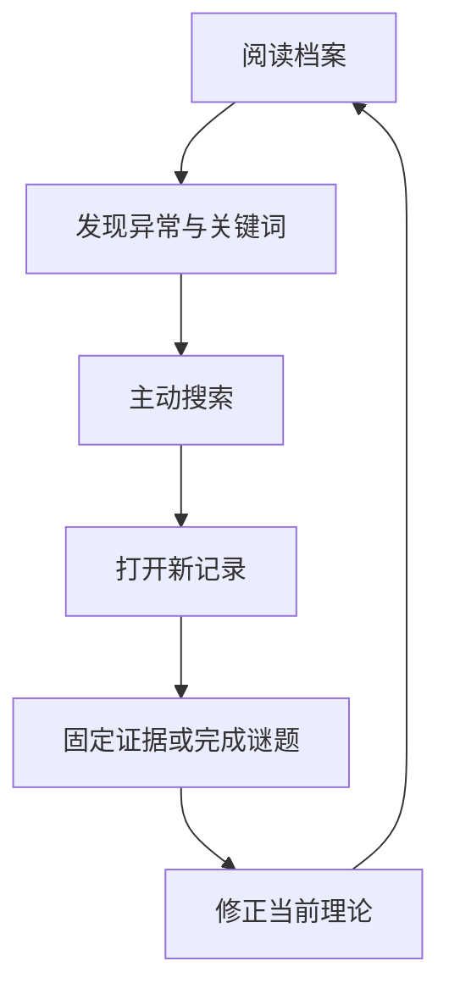
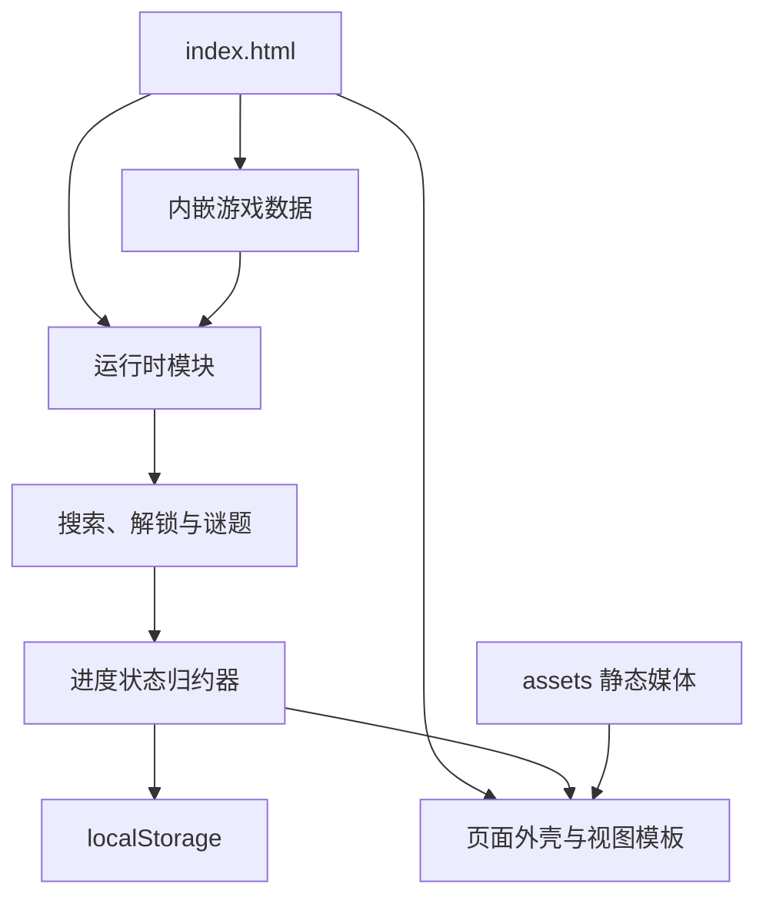
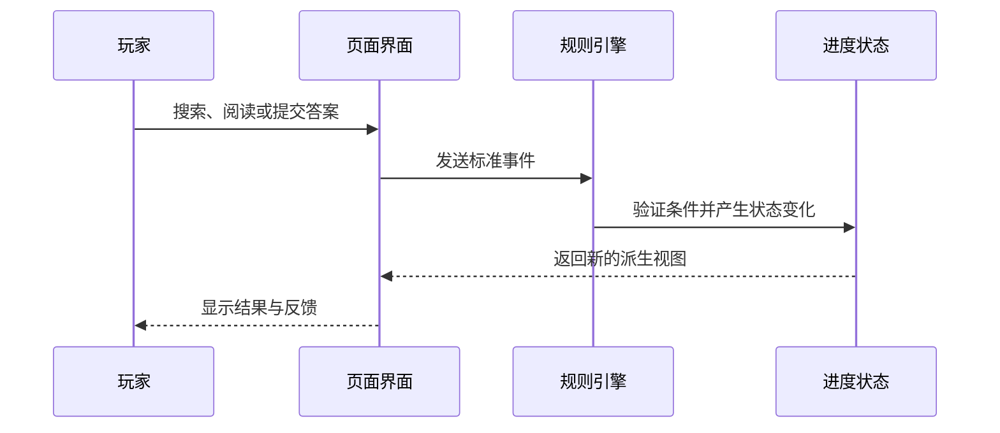
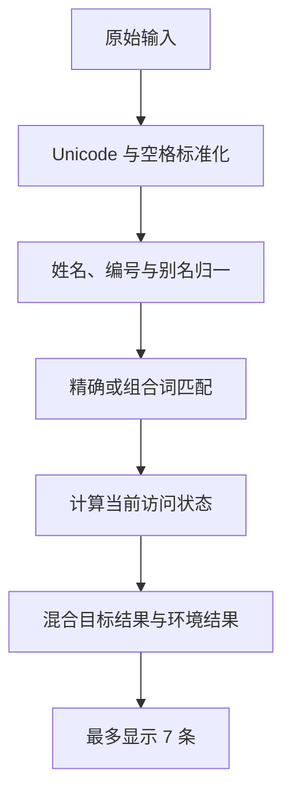
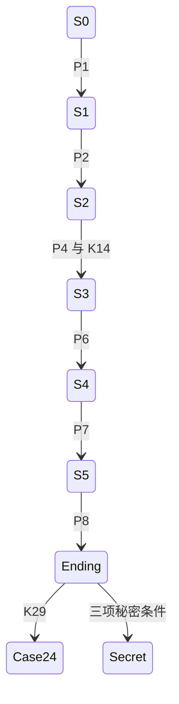

# 《锈湖档案：23号案》网页架构与工程设计 V1

> 文档性质：网页实现、内容装配、运行时状态、测试与交付的权威工程规范。  
> 项目形态：无后端、无数据库、无账号、无外部 API 的静态网页 ARG。  
> 运行代码：全部写入 `src/index.html`；图片、音频等媒体保存在 `assets/`。  
> 当前阶段：工程设计完成后，先制作 S0—S1 垂直切片，不直接一次性制作全篇。  
> 发布约束：本文件与后续实现默认只保存在本地，未经明确指示不得上传 GitHub。

---

## 0. 文档优先级

不同文档负责不同类型的事实，工程实现不得把它们混为一份。

| 优先级 | 文档 | 决定什么 |
|---:|---|---|
| 1 | `AGENTS.md` | 不可违反的叙事、体验与技术边界 |
| 2 | `docs/complete-story.md` | 原作关系、完整故事、人物情绪线和结局 |
| 3 | `docs/search-keyword-flow.md` | 关键词来源、搜索结果、解锁顺序、谜题门槛 |
| 4 | `docs/full-game-flow.md` | 逐屏幕输入输出、页面内容、剧情节拍和玩家体验 |
| 5 | 本文 | 网页架构、数据结构、状态变化、测试和工程流程 |
| 6 | `src/index.html` | 上述设计的可运行副本，不反过来改写设计 |

发生冲突时：

1. 世界观和人物关系以 `complete-story.md` 为准；
2. “玩家从哪里获得关键词、输入后看到什么”以 `search-keyword-flow.md` 为准；
3. 逐页面剧情呈现和时刻体验以 `full-game-flow.md` 为准；
4. “这些规则如何在网页中运行”以本文为准；
5. 不允许只修改 HTML 而不更新相应权威文档。

---

# 1. 工程结论

## 1.1 最终技术形态

首版采用：

> **单 HTML、数据驱动、无框架的静态单页应用。**

运行时只包含：

- 一个 `src/index.html`；
- 若干本地图片、音频和字体资源；
- 浏览器原生 HTML、CSS 与 JavaScript；
- `localStorage` 本地进度；
- Hash 路由；
- 无任何服务器端逻辑。

`index.html` 内嵌：

- 全部 CSS；
- 全部 JavaScript；
- 游戏内容数据；
- 关键词索引；
- 谜题定义；
- HTML 模板；
- 开发诊断与测试用例。

`assets/` 只保存媒体文件，不保存运行逻辑。

## 1.2 为什么不做成多个独立 HTML

多个独立页面虽然更像传统旧网站，但会产生以下问题：

- 搜索与解锁逻辑需要在每个页面重复；
- 页面间状态容易不一致；
- 修改一个公共导航需要同步修改几十个文件；
- 手动输入页面地址更容易绕过解锁条件；
- 存档恢复后难以保证当前页面与状态匹配；
- 移动端导航、提示和证据栏需要重复实现。

单页应用可以继续伪装成旧网站，同时集中管理状态和路由。

## 1.3 为什么不使用 React、Vue 或构建工具

本项目只有 31 份核心档案、8 个谜题和一套明确的线性解锁网络，不需要引入框架。

不使用：

- React、Vue、Svelte；
- TypeScript 编译；
- npm 运行时依赖；
- Webpack、Vite 等构建工具；
- CMS；
- 数据库；
- 云函数；
- 第三方搜索服务；
- 在线分析或埋点。

这样可以保证：

- 下载后仍是一套普通静态文件；
- 不因依赖升级而失效；
- 后续可部署到任意静态托管；
- 浏览器开发者工具即可调试；
- 维护成本与游戏体量匹配。

## 1.4 “所有开发都在 HTML 里”的准确含义

纯 HTML 标签本身无法完成搜索、谜题和存档，因此仍需要 JavaScript 和 CSS，但二者都内嵌在
`index.html` 中。

媒体文件不应转成 Base64 塞进 HTML，原因是：

- 会显著增大 HTML；
- 无法按需加载；
- 图片替换困难；
- 浏览器无法有效缓存单个素材；
- 会让版本对比几乎不可读。

因此采用：

> **代码单文件，媒体资源独立。**

---

# 2. 产品目标与范围

## 2.1 工程问题陈述

在不使用后端、账号和外部服务的前提下，制作一套可在现代桌面与移动浏览器运行的静态旧网站：

- 支持 29 个主线搜索节点和 9 个可选搜索节点；
- 支持 31 份核心档案、4 份辅助页面和 6 份隐藏档案；
- 支持 8 个确定性谜题；
- 能正确处理提前猜词、错误搜索、页面版本冲突和渐进提示；
- 允许玩家中断后继续；
- 首次玩家不看外部攻略也能完成主线；
- 不通过技术表现破坏正史开放性和玩家外部调查者身份。

## 2.2 三根玩法支柱

工程优先级必须服务以下三个玩家动作：

1. **浏览**：阅读页面、查看扫描件、比较版本；
2. **检索**：从材料中提取词语并主动输入；
3. **还原**：固定证据、完成谜题、修正当前理论。

所有功能都需要回答：

> 它是否让浏览、检索或还原更清晰、更有反馈？

如果答案是否定的，则不进入首版。

## 2.3 核心循环



## 2.4 80/20 工程投入

玩家大部分时间会使用以下四项能力：

| 核心能力 | 工程优先级 |
|---|---:|
| 搜索输入与结果反馈 | 最高 |
| 档案阅读、缩放与版本比较 | 最高 |
| 进度保存与恢复 | 最高 |
| 谜题提交与错误恢复 | 最高 |

首版不优先投入：

- 复杂全屏动画；
- 大量随机故障特效；
- 可操作的天气模块；
- 真正联网的访客计数器；
- 3D 场景；
- 复杂音频混音；
- 多存档角色系统；
- 成就系统；
- 社交分享；
- 自动生成内容。

## 2.5 明确不做

- 不登录；
- 不收集玩家姓名、邮箱、IP 或设备标识；
- 不跨设备同步进度；
- 不提供多人协作；
- 不使用 AI 即时生成线索；
- 不把玩家写入故事；
- 不设置永久失败；
- 不隐藏必须通过查看源码才能得到的主线答案；
- 不提供可以改变劳拉或戴尔原作结局的分支；
- 不指定劳拉的唯一凶手。

## 2.6 体验节奏约束

运行架构必须支持每 7—10 分钟出现一种新页面形式、交互方式或重大解释变化，不能让玩家连续一小时只看
相同的文字结果页。

| 阶段 | 目标时长 | 主要新鲜元素 |
|---|---:|---|
| S0 | 3—5 分钟 | 旧网站、站内搜索教学 |
| S1 | 10—15 分钟 | 多版本照片、时间线排序 |
| S2 | 12—18 分钟 | 维修图、时间戳、流程还原 |
| S3 | 15—20 分钟 | 族谱、跨年代配对 |
| S4 | 15—20 分钟 | 面具关系、证据等级 |
| S5 | 12—18 分钟 | 方块分类、最终关系报告 |

工程要求：

- 新组件只在有新内容时出现；
- 页面切换不制造虚假加载时间；
- 1—2 分钟停滞后提示入口变得可见；
- 每个阶段同时保留两条可推进路线，直到对应谜题汇合；
- 阶段内部可以自由调查，但主线解释顺序由门槛保护；
- 页面形式变化不能改变核心循环，玩家始终在浏览、检索和还原。

## 2.7 工程取舍

本项目默认选择“低成本＋高质量”，接受开发速度相对较慢。

具体做法：

- 用缩小范围代替降低核心体验质量；
- 先验证 M1，再决定是否投入后四个阶段的完整素材；
- 搜索、存档和可访问性未稳定前，不制作昂贵的氛围动画；
- 某项功能如果同时增加内容、代码和测试三种成本，应优先寻找更简单的表达；
- 如果时间不足，先减少可选环境记录和音频，不删主线证据、错误恢复或无障碍能力。

---

# 3. 总体系统架构

## 3.1 运行时结构



## 3.2 分层原则

| 层 | 职责 | 不允许做 |
|---|---|---|
| 内容层 | 档案文字、关键词、谜题和素材元数据 | 直接操作 DOM 或 localStorage |
| 规则层 | 条件判断、搜索匹配、解锁和谜题验证 | 写死页面 HTML |
| 状态层 | 处理玩家事件并生成新进度 | 包含故事正文 |
| 展示层 | 将数据渲染成网页和交互组件 | 私自决定解锁 |
| 存储层 | 读取、校验、迁移和保存进度 | 决定剧情结果 |
| 诊断层 | 校验 ID、引用、流程与资产 | 修改正式存档 |

核心要求：

> 页面是否可见只能由规则层决定，不能在某个按钮点击事件中临时写死。

## 3.3 单向数据流



展示层不能直接修改数组或解锁页面，所有变化必须通过标准事件进入状态层。

---

# 4. 项目目录

目标目录如下：

```text
rusty-lake-case23-arg/
├── AGENTS.md
├── README.md
├── docs/
│   ├── complete-story.md
│   ├── rusty-lake-case23-outline.md
│   ├── search-keyword-flow.md
│   └── web-architecture-engineering.md
├── src/
│   └── index.html
└── assets/
    ├── images/
    │   ├── site/
    │   ├── documents/
    │   ├── portraits/
    │   ├── locations/
    │   └── puzzles/
    ├── audio/
    ├── fonts/
    └── manifest.md
```

要求：

- `src/` 只保留一个正式运行文件；
- 不生成 `dist/`；
- 不提交第三方依赖；
- 不热链外部图片；
- 每个素材必须登记版权状态和用途；
- 临时草图不得混入正式素材目录。

---

# 5. `index.html` 内部结构

文件内部按固定顺序组织，禁止随意穿插。

```html
<!doctype html>
<html>
  <head>
    <!-- 01. 元数据与安全策略 -->
    <!-- 02. 全部 CSS -->
  </head>
  <body>
    <!-- 03. 无 JavaScript 说明 -->
    <!-- 04. 固定网站外壳 -->
    <!-- 05. 视图挂载点 -->
    <!-- 06. 对话框与无障碍提示区 -->
    <!-- 07. 游戏数据 JSON -->
    <!-- 08. HTML template 集合 -->
    <!-- 09. 全部 JavaScript -->
  </body>
</html>
```

## 5.1 CSS 区域顺序

一个 `<style id="case23-styles">` 内按注释分区：

1. Design tokens；
2. Reset 与基础排版；
3. 页面外壳；
4. 通用组件；
5. 档案组件；
6. 谜题组件；
7. 页面类型；
8. 响应式规则；
9. 无障碍与减少动画；
10. 打印样式；
11. 开发诊断样式。

## 5.2 数据区域

使用一个不可执行的数据块：

```html
<script type="application/json" id="game-data">
{
  "schemaVersion": 1,
  "contentVersion": "case23-v1",
  "documents": [],
  "keywords": [],
  "puzzles": []
}
</script>
```

运行时只解析这一份数据，避免同一 ID 在多个脚本中重复维护。

## 5.3 模板区域

使用原生 `<template>` 保存结构框架，例如：

- 搜索结果卡；
- 档案元数据栏；
- 扫描件查看器；
- 项目组注释；
- 版本切换；
- 证据卡；
- 提示面板；
- 错误恢复对话框。

模板只负责结构，不包含具体档案内容。

## 5.4 JavaScript 区域顺序

一个 `<script type="module" id="case23-runtime">` 内依次定义：

1. 常量与配置；
2. 数据解析与模式校验；
3. 条件表达式引擎；
4. 状态默认值与迁移；
5. 状态归约器；
6. 状态选择器；
7. 搜索引擎；
8. 解锁引擎；
9. 谜题引擎；
10. 提示引擎；
11. 路由器；
12. DOM 渲染器；
13. 事件委托；
14. 存档服务；
15. 诊断与测试；
16. 应用启动。

禁止：

- 使用 `eval`；
- 将用户输入拼进可执行代码；
- 在各组件中重复读取 localStorage；
- 将游戏状态挂满 `window`；
- 每次渲染后为大量子节点重复绑定监听器；
- 使用远程 CDN 脚本。

---

# 6. 运行时模块

虽然所有代码位于同一个 HTML，逻辑上仍必须分模块。

| 模块 | 核心职责 |
|---|---|
| `GameData` | 读取并冻结游戏内容 |
| `SchemaValidator` | 检查字段、ID 和引用 |
| `ConditionEngine` | 计算前置条件 |
| `ProgressReducer` | 处理事件并返回新状态 |
| `ProgressSelectors` | 派生阶段、理论和页面状态 |
| `SearchEngine` | 标准化、匹配、排序和结果组装 |
| `UnlockEngine` | 计算 `hidden/stub/available/conflicted` |
| `PuzzleEngine` | 验证答案、反馈和完成效果 |
| `HintEngine` | 管理停滞计时与三级提示 |
| `SaveStore` | 保存、备份、迁移、导入和导出 |
| `Router` | Hash 路由和访问保护 |
| `Renderers` | 安全生成页面 DOM |
| `AssetManager` | 延迟加载图片与音频 |
| `Diagnostics` | 运行工程自检和黄金路径模拟 |
| `App` | 启动和协调模块 |

模块间只通过明确输入输出协作，不互相读取内部变量。

---

# 7. 游戏数据架构

## 7.1 顶层数据对象

```js
{
  schemaVersion: 1,
  contentVersion: "case23-v1",
  meta: {},
  stages: [],
  theories: [],
  documents: [],
  keywords: [],
  puzzles: [],
  secrets: [],
  ambientRecords: [],
  uiText: {},
  testFixtures: {}
}
```

### 数据数量基线

诊断系统必须固定检查：

| 类型 | 数量 |
|---|---:|
| 主线关键词 `K` | 29 |
| 可选关键词 `O` | 9 |
| 核心档案 `D` | 31 |
| 辅助页面 `F` | 4 |
| 隐藏档案 `H` | 6 |
| 必要谜题 `P` | 8 |
| 阶段 `S` | 6，S0—S5 |
| 理论 `T` | 7，T0—T6 |

数量变化必须先修改 `search-keyword-flow.md`。

## 7.2 条件表达式

所有访问条件必须是数据，不写成散落的 JavaScript `if`。

支持的组合：

```js
{ all: [conditionA, conditionB] }
{ any: [conditionA, conditionB] }
{ not: conditionA }
```

支持的原子条件：

```js
{ keywordSeen: "K02" }
{ keywordSearched: "K02" }
{ documentDiscovered: "D04" }
{ documentOpened: "D04" }
{ documentVersionOpened: ["D08", "v2"] }
{ puzzleSolved: "P2" }
{ evidencePinned: "E-D10-01" }
{ secretFlag: "secret_harvey" }
{ endingComplete: true }
```

不使用 `stageReached` 作为主要前置条件。阶段是对已完成内容的总结，而不是跳过证据的万能钥匙。

## 7.3 标准效果

交互完成后只能产生以下声明式效果：

```js
{ op: "discoverDocument", id: "D10" }
{ op: "markKeywordSeen", id: "K07" }
{ op: "markKeywordSearched", id: "K07" }
{ op: "openPuzzle", id: "P3" }
{ op: "solvePuzzle", id: "P3" }
{ op: "pinEvidence", id: "E-D10-01" }
{ op: "setSecretFlag", id: "secret_harvey" }
{ op: "completeEnding" }
```

所有效果必须幂等：同一个页面打开两次不能重复添加档案或破坏存档。

---

# 8. 档案数据模型

## 8.1 标准结构

每份 D、F、H 页面使用同一基础模型：

```js
{
  id: "D04",
  route: "archive/D04",
  kind: "medical-record",
  title: "尸检摘要",
  dateLabel: "1971",
  collection: "case-23",
  sourceLabel: "锈湖警署公开副本",
  catalogLabel: "RL-23-AUT",
  canonLevel: "fan-bridge",
  voice: "police-medical",
  acquisitionMode: "search",
  defaultVisibility: "hidden",
  accessRules: [],
  versions: [],
  contentBlocks: [],
  clues: [],
  evidenceItems: [],
  onFirstOpen: [],
  relatedWhenDiscovered: [],
  assets: [],
  accessibility: {}
}
```

## 8.2 `kind`

首版允许以下页面种类：

- `site-page`
- `case-summary`
- `newspaper`
- `police-record`
- `medical-record`
- `personal-material`
- `photo-archive`
- `property-record`
- `utility-record`
- `technical-drawing`
- `institution-record`
- `family-tree`
- `historical-register`
- `project-log`
- `classification-fragment`
- `final-report`
- `ending-page`

新增种类必须有明确的新交互或新叙事作用，不能只为了换皮。

## 8.3 `canonLevel`

工程字段固定为：

| 值 | 含义 |
|---|---|
| `explicit-canon` | 原作明确 |
| `strong-implication` | 强烈暗示 |
| `fan-bridge` | 本作连接材料 |
| `indeterminate` | 有意无法判断 |

公开页面不一定逐字显示这些英文值，但最终报告和诊断系统必须使用它们。

## 8.4 `voice`

文案声音枚举：

- `local-news`
- `police`
- `medical`
- `white-door`
- `miriam-note`
- `daniel-log`
- `personal`
- `alchemy`
- `neutral-system`

数据校验应警告：

- 警察文档出现全知超自然结论；
- 白门文档直接解释完整轮回；
- 米里亚姆注释使用确定的动物身份；
- 系统页面声称玩家被选中。

语义内容仍需人工复核，程序只能检查部分禁用词。

## 8.5 页面访问规则

`accessRules` 按从具体到一般的顺序计算，首个满足项生效：

```js
[
  {
    when: { puzzleSolved: "P8" },
    state: "conflicted"
  },
  {
    when: { keywordSearched: "K27" },
    state: "stub"
  }
]
```

如果没有命中规则，使用 `defaultVisibility`。

状态只允许：

- `hidden`
- `stub`
- `available`
- `conflicted`

不得增加含义模糊的第五种状态。

## 8.6 页面内容块

所有正文使用受控内容块渲染，不在数据中写任意脚本或事件属性。

| 块类型 | 用途 |
|---|---|
| `heading` | 档案内分节 |
| `paragraph` | 普通正文 |
| `quote` | 证词、便笺和引用 |
| `metadata-table` | 编号、时间和来源 |
| `scan` | 单张扫描件 |
| `gallery` | 多版本照片 |
| `transcript` | OCR 或音频转录 |
| `archivist-note` | 米里亚姆注释 |
| `technical-note` | 丹尼尔日志 |
| `redaction` | 固定规则的遮挡文本 |
| `version-compare` | 冲突版本并列 |
| `timeline` | 时间证据 |
| `relationship-map` | 人物关系 |
| `audio` | 可选环境音或录音 |
| `puzzle-mount` | 嵌入谜题组件 |

不得让一个正文块直接改变进度；进度由“打开页面”“查看版本”“固定证据”等标准事件触发。

## 8.7 关键词来源标注

每个线索必须在数据中登记：

```js
{
  keywordId: "K08",
  blockId: "D11-meta-02",
  presentation: "visible-text",
  fallback: "ocr-transcript",
  required: true
}
```

`presentation` 可为：

- `visible-text`
- `image-detail`
- `ocr-transcript`
- `audio-transcript`
- `metadata`
- `puzzle-result`

主线关键词如果以图片细节呈现，必须同时有 OCR、文字转录或第二份材料，不允许图片像素成为唯一入口。

---

# 9. 关键词数据模型

## 9.1 标准结构

```js
{
  id: "K13",
  canonical: "Robert Hill 1972",
  category: "person-year",
  stage: "S2",
  required: true,
  sourceRefs: [
    { documentId: "D17", blockId: "D17-register-01" }
  ],
  aliases: [
    "1972 Robert Hill",
    "Bob 1972",
    "罗伯特 希尔 1972"
  ],
  tokenAliases: {
    "bob": "robert",
    "鲍勃": "robert"
  },
  resultRules: [],
  nearMatchFeedback: [],
  hints: [],
  onAcceptedSearch: []
}
```

## 9.2 关键词的唯一职责

关键词对象决定：

- 什么输入可以命中；
- 玩家应当从哪里得到该词；
- 当前状态下返回哪些结果；
- 结果是完整、占位还是冲突；
- 接近但不正确时如何反馈；
- 搜索成功产生什么标准事件。

关键词对象不包含整份档案正文。

## 9.3 别名原则

- 英文大小写自动兼容；
- 中英文姓名通过显式别名兼容；
- 姓名顺序通过 Token 规则兼容；
- 编号连字符与空格自动兼容；
- 常见角色昵称显式登记；
- 年份不可被模糊替换；
- `23` 不能自动等同 `23-BLACK`；
- `black` 不能自动等同 `BLACK STATE`；
- 代码类关键词不使用编辑距离模糊匹配。

别名冲突必须在诊断模式报错，不能按照数组先后顺序静默决定。

---

# 10. 搜索引擎设计

## 10.1 搜索处理流水线



## 10.2 标准化顺序

1. Unicode `NFKC`；
2. 去除首尾空格；
3. 多空格合一；
4. 英文字母转小写；
5. 中文标点转普通分隔符；
6. 姓名句点标准化；
7. 编号中的空格和连字符生成等价签名；
8. 昵称和中英文姓名映射；
9. 组合词按规则生成无序 Token 签名；
10. 保留原始输入用于本地搜索历史。

## 10.3 匹配等级

从高到低：

| 等级 | 行为 |
|---|---|
| 精确标准词 | 直接命中 |
| 显式别名 | 直接命中 |
| 等价 Token 组合 | 直接命中 |
| 受控常见拼写错误 | 关键词已见时可命中 |
| 接近匹配 | 只提示“是否指”，不直接解锁 |
| 宽泛元数据匹配 | 返回普通环境记录 |
| 无匹配 | 语义错误反馈 |

不使用无限制全文模糊搜索，否则玩家输入 `lake`、`black` 就会提前看到后期材料。

## 10.4 搜索结果状态

搜索结果卡显示内容由 `UnlockEngine` 决定：

| 状态 | 结果卡 |
|---|---|
| `hidden` | 不显示 |
| `stub` | 标题、年代、来源、附件未恢复说明 |
| `available` | 标题、摘要、来源和打开按钮 |
| `conflicted` | 标题、版本数量、来源冲突提示 |

搜索引擎不能因为输入正确就绕过谜题门槛。

## 10.5 提前猜词处理

以下情况必须写入自动测试：

| 提前输入 | 允许结果 |
|---|---|
| K12 `White Door` | 可查看 D17，但不能自动得到 D18 |
| K15 `A. Vanderboom 1859` | 只显示 1859 登记占位 |
| K21 `Dale Vandermeer 1939` | 只显示受限家庭记录 |
| K27 `23-BLACK` | 始终显示缺失附件占位，直到条件满足 |
| K29 `CASE 24` | P8 前不能显示戴尔条目 |

熟悉原作的玩家可以提前猜到名词，但不能跳过证据链和 P2—P8。

## 10.6 宽泛搜索与环境记录

`lake`、`death`、`hotel`、单一年份等宽泛输入需要返回普通小镇资料，使网站看起来不是只为谜题存在。

这些结果存放在 `ambientRecords`：

- 不计入 D/F/H 数量；
- 不进入已发现档案；
- 不提供主线关键词；
- 不可固定为最终报告证据；
- 只显示简短目录卡，不制作完整页面；
- 不得淹没已满足条件的精确主线结果。

## 10.7 排序

结果分数建议：

| 条件 | 分值 |
|---|---:|
| 标准关键词精确命中 | 100 |
| 显式别名命中 | 95 |
| 组合 Token 完全匹配 | 90 |
| 标题精确匹配 | 75 |
| 姓名和年份同时匹配 | 70 |
| 单一元数据匹配 | 40 |
| 环境记录 | 10—30 |

规则：

- 状态不改变匹配分，只改变可见内容；
- 每页最多 7 条；
- 至少保留 1 条合理环境结果时，不得把精确目标挤出首屏；
- 同分使用固定 ID 排序，保证相同输入得到相同结果。

## 10.8 搜索失败

失败不扣除任何资源，不锁定输入。

反馈层级：

1. 标出已识别的姓名、年份或档案系列；
2. 告知缺少哪类信息，不告知答案；
3. 连续接近或停滞后开放项目组提示。

用户输入必须通过 `textContent` 显示，禁止直接插入 `innerHTML`。

---

# 11. 进度状态

## 11.1 唯一存档对象

```js
{
  schemaVersion: 1,
  contentVersion: "case23-v1",
  searchedKeywords: [],
  seenKeywords: [],
  discoveredDocuments: [],
  openedDocuments: [],
  openedDocumentVersions: {},
  solvedPuzzles: {},
  puzzleDrafts: {},
  pinnedEvidence: [],
  hintLevels: {},
  searchHistory: [],
  secretFlags: {},
  endingComplete: false,
  settings: {
    sound: true,
    reducedMotion: false,
    highContrast: false,
    autoHints: true,
    textScale: 1
  },
  lastRoute: "#/home",
  updatedAt: ""
}
```

## 11.2 不直接保存的派生状态

以下内容每次根据进度重新计算：

- `currentStage`；
- `currentTheory`；
- 每份文档的可见状态；
- 可用谜题；
- 已解锁导航入口；
- 主线完成比例；
- 隐藏结局资格。

这样可以避免出现：

> 存档说玩家在 S4，但 P3 尚未完成。

## 11.3 标准事件

状态只能响应：

- `SEARCH_SUBMITTED`
- `KEYWORD_ACCEPTED`
- `DOCUMENT_DISCOVERED`
- `DOCUMENT_OPENED`
- `DOCUMENT_VERSION_OPENED`
- `EVIDENCE_PINNED`
- `EVIDENCE_UNPINNED`
- `PUZZLE_DRAFT_UPDATED`
- `PUZZLE_SOLVED`
- `HINT_REQUESTED`
- `SECRET_FLAG_SET`
- `ENDING_COMPLETED`
- `SETTINGS_CHANGED`
- `SAVE_IMPORTED`
- `PROGRESS_RESET`

每个事件结构至少包含：

```js
{
  type: "DOCUMENT_OPENED",
  payload: { documentId: "D04" }
}
```

状态归约器必须是纯函数：相同状态和事件得到相同结果。

## 11.4 阶段与理论

阶段按完成门槛派生：



理论按最高已满足条件派生：

| 理论 | 条件 |
|---|---|
| T0 | 初始 |
| T1 | P2 |
| T2 | P4 与 K14 |
| T3 | P6 |
| T4 | P7 |
| T5 | K27 完整可读 |
| T6 | P8 |

旧理论不删除，在“研究记录”中显示其被哪些证据修正。

---

# 12. 存档工程

## 12.1 localStorage 键

固定使用：

```text
rusty-lake-case23:save:v1
rusty-lake-case23:backup:v1
rusty-lake-case23:settings:v1
```

不写入其他站点键名。

## 12.2 保存时机

以下事件成功后立即保存：

- 关键词首次命中；
- 新档案发现；
- 档案首次打开；
- 新版本查看；
- 证据固定或移除；
- 谜题草稿修改，使用 300ms 防抖；
- 谜题完成；
- 提示级别变化；
- 设置变化；
- 结局完成。

## 12.3 原子保存

保存流程：

1. 校验内存状态；
2. 将上一份有效存档复制到 backup 键；
3. 写入新存档；
4. 重新读取并解析；
5. 解析成功才显示“已保存”状态。

如果 localStorage 不可用：

- 游戏继续运行于当前标签页；
- 明确提示“关闭页面后进度可能丢失”；
- 提供“导出进度”；
- 不反复弹窗打断。

## 12.4 存档迁移

每次结构变化递增 `schemaVersion`。

迁移函数只允许按顺序执行：

```text
v1 → v2 → v3
```

禁止直接假设旧存档已经拥有新字段。

迁移后：

- 未知旧 ID 保留在 `legacy` 临时区；
- 已删除 ID 不参与解锁；
- 迁移失败时恢复 backup；
- 不自动清空玩家进度。

## 12.5 导入、导出和重置

设置页面提供：

- 导出为 JSON；
- 从 JSON 导入；
- 恢复最近备份；
- 重置全部进度。

导入时必须：

- 验证 schema；
- 过滤未知字段；
- 限制文件大小；
- 不解析 HTML；
- 不执行任何导入字符串。

重置需要二次确认，并说明会删除哪些本地数据。

---

# 13. 解锁引擎

## 13.1 页面状态计算

对每份页面：

1. 读取 `accessRules`；
2. 从第一条开始计算；
3. 返回首个满足条件的状态；
4. 无规则命中则返回默认状态；
5. 如果已经发现，但后续规则错误地降为 `hidden`，诊断系统报错。

除明确的版本冲突剧情外，已完整发现的档案不应重新隐藏。

## 13.2 第一次获得方式

`acquisitionMode` 只允许：

- `direct`：D01、D02 等开场材料；
- `attachment`：D03 等开场附件；
- `search`：大部分新档案；
- `puzzle`：D10 等谜题结果；
- `ending`：D31；
- `secret`：H 页面。

新主线档案第一次出现必须符合 `search-keyword-flow.md`，不能通过“相关推荐”提前泄露。

## 13.3 已发现档案

“已发现档案”只列出：

- 玩家已经打开的 D/F/H；
- 当前可再次访问的版本；
- 玩家自己固定的证据。

不能列出：

- 未发现标题；
- 未知总数量；
- 隐藏页面占位；
- 后期文件名；
- 下一阶段分类。

主结局前不显示“31 份总档案”。30/31 的差异只在结尾使用。

## 13.4 手动地址保护

Hash 地址不能成为跳关方式。

例如玩家直接输入：

```text
#/archive/D29
```

若 D29 为：

- `hidden`：显示普通“目录中没有可公开记录”，不显示标题；
- `stub`：只显示允许的占位信息；
- `available`：正常打开；
- `conflicted`：打开版本比较页。

未知 ID 显示站内 404，不跳回首页造成循环。

---

# 14. 路由与信息架构

## 14.1 Hash 路由

使用 Hash 的原因：

- 静态托管无需配置 URL 重写；
- 浏览器前进后退可用；
- 直接刷新不产生服务器 404；
- 单个 HTML 即可运行。

正式路由：

| 路由 | 页面 |
|---|---|
| `#/home` | 停更首页 |
| `#/about` | 数字化项目介绍 |
| `#/catalog` | 公开目录 |
| `#/search` | 搜索首页 |
| `#/search?q=...` | 搜索结果 |
| `#/archive/:id` | D/F/H 档案 |
| `#/puzzle/:id` | 谜题 |
| `#/discoveries` | 已发现档案 |
| `#/research` | 当前与历史理论 |
| `#/evidence` | 已固定证据 |
| `#/logs` | 项目日志 |
| `#/report` | 最终关系报告 |
| `#/settings` | 设置、存档与帮助 |
| `#/diagnostics` | 仅 Debug 模式 |

搜索查询写入 Hash 时必须编码和解码，显示时使用纯文本。

## 14.2 固定网站外壳

桌面结构：

1. 网站横幅；
2. 2008 年停更状态条；
3. 固定导航；
4. 主内容；
5. 调查侧栏；
6. 页脚、免责声明和项目来源。

调查侧栏只显示：

- 当前可做的宽泛目标；
- 最近发现；
- 已固定证据数量；
- 提示入口。

不直接显示下一标准关键词。

## 14.3 移动端

小屏幕时：

- 导航折叠为可访问菜单；
- 搜索框保持首要位置；
- 调查侧栏变为底部抽屉；
- 扫描件查看器支持双指缩放或显式缩放按钮；
- 谜题不能只依赖拖拽；
- 表格可横向滚动，并保留行标题；
- 固定操作区不得遮挡正文。

## 14.4 页面进入行为

每次路由切换：

1. 验证访问权限；
2. 渲染页面；
3. 将焦点移动到主标题；
4. 恢复或重置滚动位置；
5. 标记合法的首次打开；
6. 延迟加载当前资产；
7. 重置与当前任务相关的停滞计时。

浏览器后退应恢复前页滚动位置，不重复触发首次发现效果。

---

# 15. 页面与组件系统

## 15.1 通用组件

| 组件 | 职责 |
|---|---|
| `SiteHeader` | 网站身份、停更状态 |
| `PrimaryNav` | 固定分类导航 |
| `SearchBox` | 搜索输入与历史建议 |
| `SearchResultCard` | 展示结果状态 |
| `DocumentHeader` | 标题、编号、来源、年代 |
| `DocumentBlockRenderer` | 渲染受控内容块 |
| `ScanViewer` | 缩放、平移、OCR、替代文本 |
| `VersionSwitcher` | 切换冲突档案版本 |
| `ArchivistNote` | 项目组解释 |
| `EvidencePin` | 固定或移除证据 |
| `ResearchPanel` | 旧理论与修正证据 |
| `PuzzleFrame` | 统一谜题标题、反馈和提示 |
| `HintPanel` | 三级提示 |
| `ToastRegion` | 非阻塞状态反馈 |
| `ModalDialog` | 导入、重置和错误恢复 |

## 15.2 档案标准版式

每份正式档案按以下顺序：

1. 档案标题；
2. 编号、年代、来源、录入者；
3. 来源可信度或版本状态；
4. 原始扫描或主要材料；
5. OCR／转录；
6. 项目组注释；
7. 可固定证据；
8. 已发现的相关档案；
9. 返回搜索结果或上一路径。

“相关档案”只能显示已经发现的页面。

## 15.3 扫描件查看器

必须支持：

- 放大、缩小、恢复；
- 键盘按钮；
- 触摸操作；
- 全屏或大图模式；
- OCR 切换；
- 图片加载失败占位；
- 关键图像的详细替代文本。

不能把主线答案只藏在低对比度像素中。

## 15.4 版本冲突页

`conflicted` 状态提供：

- 版本 A/B/C 标签；
- 相同来源信息；
- 可并排或逐一比较；
- 差异摘要只描述可观察变化；
- 每个版本独立记录为“已查看”；
- 不提供“哪个是真的”按钮。

H01、H04 等可选秘密可以依赖“多个版本均已查看”，但主线关系仍需两份独立证据。

---

# 16. 谜题引擎

## 16.1 统一谜题模型

```js
{
  id: "P2",
  type: "ordering",
  title: "现场时间线",
  prerequisites: {},
  evidenceRequirements: [],
  promptBlocks: [],
  interaction: {},
  solution: {},
  feedback: {
    incomplete: "",
    incorrect: [],
    correct: ""
  },
  hints: [],
  onSolved: []
}
```

## 16.2 八个谜题的组件映射

| 谜题 | 交互组件 | 工程重点 |
|---|---|---|
| P1 案件编号 | 搜索教学 | 不额外制作密码框 |
| P2 现场时间线 | 排序列表 | 支持按钮移动，不只拖拽 |
| P3 磨坊关联 | 多证据交叉确认 | 选择三项材料并提交结论 |
| P4 提取流程 | 步骤排序 | 时间戳与管线编号同时可见 |
| P5 范德布姆族谱 | 树形槽位 | 移动端改为逐槽选择 |
| P6 灵药交换 | 配对表 | 明确“人物—结果—身份”三列 |
| P7 面具关系 | 多组匹配 | 区分“高度相关”和“绝对同一” |
| P8 最终报告 | 六项关系与证据等级 | 每项至少两份证据 |

## 16.3 公平性

每个必要谜题：

- 目标明确；
- 相同输入得到相同结果；
- 不要求随机试错；
- 答案至少由两份可发现材料支持；
- 失败不清空其他正确部分；
- 不限制尝试次数；
- 不设置倒计时；
- 不依赖声音或颜色作为唯一信息；
- 允许键盘和触摸完成。

## 16.4 答案验证

结构化谜题比较稳定 ID，不比较玩家看到的显示文本。

例如配对项内部使用：

```js
{
  leftId: "william",
  resultId: "death",
  identityId: "corrupted-soul"
}
```

这样修改中文文案不会破坏答案。

## 16.5 P8 特殊规则

最终报告的每一项需要：

1. 选择关系结论；
2. 选择证据等级；
3. 固定至少两份已发现证据。

反馈需要区分：

- 关系错误；
- 人物正确但年代错误；
- 证据数量不足；
- 证据与结论无关；
- 关系高度相关，但证据等级过强；
- 结论正确。

兔面关系不能接受“原作明确的绝对同一身份”。

戴尔只能接受“被观察、测试并可能成为继承候选者”，不能接受“已经正式继任”。

## 16.6 静态网页的答案可见性

所有逻辑都在客户端，查看源码的玩家理论上可以找到答案。

工程策略是：

- 不做无意义代码混淆；
- 不假装具备反作弊能力；
- 让答案数据远离可见文案区域；
- 主线不要求查看源码；
- 可选源码彩蛋不得改变正史或主线进度；
- 测试以普通玩家体验为准。

---

# 17. 提示系统与错误恢复

## 17.1 停滞判断

默认规则：

- 当前存在明确可推进目标；
- 玩家 90 秒没有产生有效进展；
- 页面标签处于可见状态；
- 玩家未关闭自动提示。

满足后只显示：

> 项目组整理建议已更新。

不自动展开答案。

## 17.2 三级提示

| 级别 | 内容 |
|---|---|
| 1 | 指出需要寻找的信息类型 |
| 2 | 指出材料所在页面 |
| 3 | 指出组合方式，但不替玩家自动提交 |

提示按 K 或 P 独立保存。

## 17.3 计时重置

以下行为视为有效进展：

- 命中新关键词；
- 首次打开档案；
- 首次查看冲突版本；
- 固定相关证据；
- 谜题部分答案正确；
- 完成谜题。

以下行为不应无限重置计时：

- 鼠标移动；
- 页面空白点击；
- 重复打开同一页；
- 重复输入同一错误词。

## 17.4 错误分类

| 错误 | 处理 |
|---|---|
| 搜索词接近 | 说明识别到的人名、年份或编号部分 |
| 遗漏步骤 | 保留已完成部分并指出缺少证据类型 |
| 关系过度确定 | 说明关联成立但证据等级不足 |
| 手动进入受限路由 | 返回合理的档案占位 |
| 素材加载失败 | 显示转录和重试按钮 |
| 存档损坏 | 尝试备份并提供导出 |
| 未知页面 | 站内 404，并保留导航 |

任何玩家错误都不能永久破坏进度。

---

# 18. 可选秘密与结局

## 18.1 秘密标志

至少包含：

```js
{
  secret_harvey: false,
  secret_masks: false,
  secret_cubes: false,
  secret_clock: false,
  secret_moths: false,
  secret_checksum: false
}
```

具体触发条件以 `search-keyword-flow.md` 为准。

秘密标志：

- 不进入主线完成率；
- 不显示为未完成清单；
- 不阻止 P8；
- 可以开放 H 页面；
- 不改变人物结局；
- 不显示玩家身份信息。

## 18.2 主结局

P8 完成后：

1. D30 生成三层结论；
2. 案件状态改为“不适用线性因果”；
3. 保存 `endingComplete`；
4. 允许 K29 命中 D31；
5. 首页目录出现符合规则的新条目；
6. 不强制玩家立即进入 CASE 24。

## 18.3 隐藏余韵

H06 只在三项秘密条件与主结局均满足后开放。

页面只展示：

- 湖面；
- 电梯按钮；
- 远处旅馆灯光；
- Harvey 的轮廓；
- 环境声音。

不出现：

- 玩家姓名；
- “我们一直在看你”；
- 新的关键正史结论；
- 强制续作任务。

---

# 19. 视觉与 CSS 工程

## 19.1 Design Tokens

使用 CSS 自定义属性集中管理：

```css
:root {
  --color-paper: #eee8d5;
  --color-ink: #222;
  --color-link: #183b78;
  --color-border: #8a877d;
  --color-warning: #6d1f1f;
  --space-1: 0.25rem;
  --space-2: 0.5rem;
  --space-3: 0.75rem;
  --space-4: 1rem;
  --content-width: 72rem;
}
```

最终颜色另行视觉设计，此处只规定集中管理方式。

## 19.2 旧网站感的实现边界

可以使用：

- 米白底色；
- 深蓝链接；
- 灰色表格；
- 低清扫描缩略图；
- 早期网页横幅；
- 简单 GIF 风格图标；
- 克制的边框和阴影；
- 固定年代的项目页脚。

不能用“难用”模拟年代：

- 不使用 10px 正文字号；
- 不用低对比度隐藏主线；
- 不让布局只适配 800×600；
- 不制造无法关闭的弹窗；
- 不自动播放高音量音频；
- 不用闪烁内容制造惊吓；
- 不让链接颜色彼此不可区分。

## 19.3 氛围变化

网站外壳始终保持 2008 年只读备份的稳定外观。

不通过“网站认识玩家”来变化，而通过不同档案集合表现：

- 警察和报纸页面较正常；
- 磨坊材料加入机械线条和低频音；
- 家族材料使用树根与旧纸；
- 洞穴材料引入白、黑、蓝、金；
- 冲突页面出现结构上的细微不一致。

视觉差异由当前档案类型决定，不生成针对玩家的私人信息。

## 19.4 动效

动效只用于：

- 页面状态反馈；
- 扫描件打开；
- 证据固定；
- 版本切换；
- 谜题完成；
- 结局过渡。

所有非必要动效尊重 `prefers-reduced-motion` 和游戏内减少动画设置。

---

# 20. 无障碍

最低要求：

- 使用语义化 `header/nav/main/aside/footer`；
- 每页一个主 `h1`；
- 所有交互均可键盘完成；
- 可见焦点不能移除；
- 对话框正确管理焦点；
- 搜索结果数量通过 `aria-live="polite"` 播报；
- 错误信息与输入框关联；
- 图像具有替代文本；
- 录音具有转录；
- 颜色不是唯一线索；
- 拖拽谜题具有按钮式替代操作；
- 文字支持至少 200% 放大；
- 扫描件可切换 OCR；
- 不使用持续闪烁；
- 音频默认较低或等待玩家主动开启。

旧式视觉和现代可用性发生冲突时，优先可用性。

---

# 21. 音频

首版音频不是主线信息载体。

允许：

- 湖风；
- 轻微硬盘声；
- 拨号或连接声；
- 磨坊机械低频；
- 电梯声；
- 很轻的动物环境声。

要求：

- 默认不自动播放有明显音量的声音；
- 页面首次交互后才允许启用音频；
- 提供全局静音；
- 标签页隐藏后暂停；
- 同时最多一个主环境音轨；
- 任何语音都有文字转录；
- 音频失败不影响谜题。

---

# 22. 静态素材工程

## 22.1 命名

```text
assets/images/documents/d08-scene-v1.webp
assets/images/documents/d08-scene-v2.webp
assets/images/documents/d08-scene-v3.webp
assets/images/puzzles/p04-extractor-diagram.webp
assets/audio/ambience/mill-loop.ogg
```

规则：

- 全部小写；
- 使用连字符；
- 文件名包含 D/F/H/P ID；
- 版本号明确；
- 不使用“final-final2”；
- 替换素材时不改变无关路径。

## 22.2 素材清单

`assets/manifest.md` 为每个素材登记：

| 字段 | 内容 |
|---|---|
| Asset ID | 唯一编号 |
| 文件路径 | 相对路径 |
| 用途 | 哪份档案或谜题 |
| 来源 | 原创、授权或公共领域 |
| 权利说明 | 是否允许发布 |
| 替代文本 | 无障碍描述 |
| 关键线索 | 是否承载主线信息 |
| 备用转录 | 图片或音频失败时展示 |

## 22.3 图片预算

建议基线：

- 普通缩略图：不超过 80 KB；
- 常规档案图：不超过 350 KB；
- 可缩放关键扫描：不超过 700 KB；
- 首屏总资源：不超过 2 MB；
- `index.html` 未压缩：目标不超过 1.5 MB；
- 完整项目：目标不超过 25 MB。

图片使用 `loading="lazy"`，首屏横幅除外。

## 22.4 格式

- 照片和纸张扫描优先 WebP/JPEG；
- 需要透明背景时用 PNG/WebP；
- 简单图标和关系图优先内嵌 SVG；
- 音频提供至少一种现代浏览器通用格式；
- 不使用外部字体 CDN；
- 若本地字体并非必要，优先系统字体栈。

---

# 23. 性能

## 23.1 启动目标

在普通移动网络和中端设备上：

- HTML 解析后尽快显示网站外壳；
- 首屏不等待所有档案图片；
- 搜索索引构建不阻塞明显交互；
- 路由切换不整页刷新；
- 搜索响应目标小于 100ms；
- localStorage 状态控制在 100 KB 内。

## 23.2 优化方法

- 数据只解析一次；
- 搜索索引启动时生成一次；
- 使用 ID Map，避免反复遍历全部数组；
- 事件委托绑定在应用根节点；
- 图片按路由延迟加载；
- 音频不预加载；
- 页面 DOM 离开路由后释放；
- 搜索历史最多保存最近 100 条；
- Toast 和日志数量设上限；
- 谜题草稿防抖保存。

## 23.3 暂不使用 Service Worker

V1 不做 PWA 和 Service Worker，原因是：

- 容易缓存过期的单 HTML；
- 会增加调试和发布复杂度；
- 本项目没有离线安装刚需；
- 静态托管本身已经足够。

后续只有在明确需要离线安装时再单独立项。

---

# 24. 安全、隐私与同人边界

## 24.1 安全

虽然没有服务器，仍需防止本地输入破坏页面：

- 搜索词使用 `textContent`；
- 不执行 URL 参数；
- 不使用 `eval` 或 `new Function`；
- 不把导入存档渲染成 HTML；
- JSON 导入限制大小；
- 外部链接使用明确提示；
- 不加载第三方脚本；
- 不开放任意文件路径；
- 内容块渲染器只接受白名单类型。

## 24.2 隐私

本项目不进行：

- 分析埋点；
- Cookie 跟踪；
- 指纹识别；
- 广告；
- 外部错误上报；
- 远程搜索；
- 云存档。

搜索历史和进度仅保存在玩家浏览器。

技术用 `updatedAt` 只用于存档恢复，不能被网页叙事解释成网站监视玩家。

## 24.3 同人项目

必须保留：

- 非官方、非商业声明；
- Rusty Lake 与 Cube Escape 权利归属说明；
- 原创或合法授权素材；
- 不复制原作付费美术、音乐和完整文本；
- 不冒充官方网站；
- 不使用官方商标制造商业混淆。

---

# 25. 可靠性与故障降级

## 25.1 启动失败

启动时依次检查：

1. 游戏数据 JSON 是否能解析；
2. schema 是否兼容；
3. 必需 ID 是否存在；
4. 存档是否有效；
5. 当前路由是否合法。

如果游戏数据损坏：

- 显示静态错误页；
- 不覆盖现有存档；
- 提供复制错误代码；
- Debug 模式显示具体字段；
- 正式模式不泄露大量源码。

## 25.2 素材失败

图片失败时：

- 显示档案编号；
- 显示替代文本或 OCR；
- 提供重试；
- 主线仍可继续。

音频失败时静默降级，不显示阻断弹窗。

## 25.3 存档损坏

顺序：

1. 尝试解析主存档；
2. 尝试恢复 backup；
3. 如果都失败，保留损坏字符串供导出；
4. 让玩家选择新建进度；
5. 不自动执行重置。

---

# 26. 开发诊断模式

## 26.1 开启方式

仅当地址包含：

```text
?debug=1#/diagnostics
```

时开放诊断页。

诊断模式不能修改正式存档，默认使用内存测试状态。

## 26.2 自动数据校验

必须检查：

- ID 唯一；
- K01—K29 连续；
- O01—O09 连续；
- D01—D31 连续；
- F01—F04 连续；
- H01—H06 连续；
- P1—P8 连续；
- S0—S5 和 T0—T6 完整；
- 所有引用目标存在；
- 每个必搜词至少有一个可达来源；
- 每个必要谜题至少有两条证据；
- 别名没有冲突；
- 每个档案有来源、声音和正史等级；
- 每个图片关键线索有文字替代；
- 每个页面至少完成叙事、线索、谜题或情感任务之一；
- 没有页面把自己设为唯一前置条件；
- 没有 `available` 页面在后续回退成 `hidden`；
- D31 不能在 P8 前完整开放；
- H 页面不影响主线；
- P8 不接受唯一凶手答案。

## 26.3 黄金路径模拟

诊断系统内置一条标准事件序列：

```text
K01 → K02/K03/K04/K05/K06 → P2
→ K07/K08/K09/K10 → P3 → K11 → P4
→ K12/K13/K14 → K15/K16/K17/K18 → P5
→ K19 → P6 → K20/K21/K22/K23/K24 → P7
→ K25/K26/K27/K28 → P8 → K29
```

模拟后断言：

- D01—D31 均按规定获得；
- 没有后期档案提前完整开放；
- T0—T6 顺序正确；
- 结局可完成；
- 不完成秘密也能结案；
- 完成秘密后 H06 可进入。

## 26.4 逆向与边界测试

至少覆盖：

- 先输入 K29；
- 先输入 K27；
- 只输入 `23`；
- 只输入 `black`；
- 中文姓名；
- 英文姓名倒序；
- 编号去连字符；
- 年份放在最前；
- 搜索空字符串；
- 搜索超长字符串；
- 重复完成同一谜题；
- 存档中缺少字段；
- 存档包含未知 ID；
- 从冲突版本页直接刷新；
- 关闭 localStorage；
- 图片加载失败。

---

# 27. 测试策略

## 27.1 测试层级

| 层级 | 目标 |
|---|---|
| 数据自检 | ID、引用、数量和可达性 |
| 规则单元测试 | 搜索、条件、解锁、谜题和迁移 |
| 黄金路径测试 | 主线从头到尾可完成 |
| 回归测试 | 修改后旧流程仍可运行 |
| 白盒测试 | 指定路由、存档和边界条件 |
| 黑盒测试 | 玩家自然行为是否符合设计 |
| Kleenex 测试 | 首次玩家是否理解搜索教学 |
| 无障碍测试 | 键盘、读屏、缩放、对比度 |
| 浏览器测试 | Chrome、Edge、Firefox、Safari |

静态项目不需要服务器压力测试。

## 27.2 浏览器基线

正式支持：

- Chrome 最近两个主要版本；
- Edge 最近两个主要版本；
- Firefox 最近两个主要版本；
- Safari 最近两个主要版本；
- iOS Safari 最近两个主要版本；
- Android Chrome 最近两个主要版本。

`file://` 下的 localStorage 行为在不同浏览器并不稳定，正式体验应通过 HTTPS 静态托管。
本地开发可使用简单静态服务器预览，但服务器不属于游戏产品。

## 27.3 首轮玩家验收

延续 `search-keyword-flow.md` 的指标：

- 80% 以上测试者能在 5 分钟内完成 K01；
- 70% 以上测试者无需明确答案完成 S1；
- 没有人把 D10 误解为存在秘密运输车；
- 大多数玩家在 S2 后不再把鲍勃视为主要凶手；
- 玩家理解劳拉与威廉的关系，但不说“劳拉只是威廉”；
- 玩家把兔面身份标为高度相关，而非被迫确认；
- 玩家理解 `23-BLACK` 不提供唯一死亡版本；
- 任何卡关可通过三级提示恢复；
- 不看攻略可以到达 D30；
- 不完成秘密可以正常结案。

---

# 28. 开发里程碑

采用“垂直切片后逐阶段扩展”，不先做完全部页面再统一接逻辑。

## M0：运行骨架

交付：

- `src/index.html`；
- 页面外壳；
- Hash 路由；
- 游戏数据读取；
- schema 校验；
- 状态归约器；
- localStorage；
- 搜索框空壳；
- Debug 诊断页；
- 无 JavaScript 提示。

验收：

- 页面可在静态服务器打开；
- 刷新与前进后退正常；
- 空白存档、损坏存档和禁用存储均有降级；
- 不包含正式剧情素材也能验证架构。

## M1：S0—S1 垂直切片

范围：

- D01—D10；
- K01—K06；
- P1、P2；
- T0、T1；
- 首页、搜索、档案、发现页、证据栏；
- 第一级至第三级提示；
- 第一批移动端和无障碍交互。

验收：

- 第一次玩家能从首页找到 CASE 23；
- 能通过搜索获得劳拉、鲍勃、戴尔和现场材料；
- 能完成时间线；
- 理解不存在现实遗体交接链；
- 提前输入后期关键词不会跳关；
- 进度刷新后保留。

只有 M1 黑盒测试通过，才继续制作后续章节。

## M2：S2 磨坊与白门

范围：

- D11—D18；
- K07—K14；
- P3、P4；
- 设备图、时间戳和版本照片组件；
- 鲍勃情绪线；
- T2。

验收：

- 玩家能证明磨坊关联；
- 不会误解为常规车辆运输；
- 能还原提取流程；
- 白门线与磨坊线均能独立推进后再汇合。

## M3：S3 范德布姆家族

范围：

- D19—D22；
- K15—K19；
- P5、P6；
- 族谱组件；
- 灵药配对；
- T3。

验收：

- 族谱在桌面和移动端均可完成；
- 玩家能区分“劳拉是威廉转世”与“劳拉没有独立人格”；
- 乌鸦先生的关系结论有足够证据。

## M4：S4 旅馆、天堂岛与戴尔

范围：

- D23—D27；
- K20—K24；
- P7；
- 面具配对和关系等级；
- T4。

验收：

- 玩家能建立高度相关链；
- 系统拒绝无证据的绝对同一；
- 戴尔仍是受害者与调查者，不被写成已继任者。

## M5：S5、结局与秘密

范围：

- D28—D31；
- F01—F04；
- H01—H06；
- K25—K29；
- O01—O09；
- P8；
- T5、T6；
- 主结局与隐藏余韵。

验收：

- `23-BLACK` 按条件从 stub 转为 conflicted；
- P8 六项关系全部要求足够证据；
- 结局不指定唯一凶手；
- D31 只在 P8 后开放；
- H06 不影响主线。

## M6：整体打磨

范围：

- 全流程回归；
- 黑盒测试；
- 无障碍修复；
- 浏览器兼容；
- 图片与音频压缩；
- 文案一致性；
- 免责声明；
- 发布检查。

验收：

- 所有自动诊断通过；
- 无主线死路；
- 没有未登记素材；
- 60—90 分钟体验节奏基本成立；
- 所有关键结论遵守正史等级。

---

# 29. 每项内容的完成定义

## 29.1 档案完成定义

一份档案只有同时满足以下条件才算完成：

- ID 与标题登记；
- 首次获得方式正确；
- 四态访问规则完整；
- 来源、年代、录入者齐全；
- 文档声音正确；
- 正史等级已标记；
- 内容块可渲染；
- 关键词位置已登记；
- 主线图像有 OCR 或替代证据；
- 证据项可固定；
- 相关档案不泄露未发现内容；
- 移动端可读；
- 键盘可访问；
- 素材失败时有备用文本；
- 自动诊断通过；
- 人工连续性检查通过。

## 29.2 关键词完成定义

- 标准词与 K/O ID 对应；
- 来源页面和具体位置登记；
- 中英文与必要别名登记；
- 输入顺序规则明确；
- 当前阶段结果明确；
- 提前输入结果明确；
- 接近输入反馈明确；
- 搜索成功效果明确；
- 不与其他关键词别名冲突；
- 自动测试覆盖。

## 29.3 谜题完成定义

- 前置条件正确；
- 至少两条证据；
- 目标和规则清晰；
- 答案确定；
- 错误分类反馈完整；
- 三级提示完整；
- 不限制尝试；
- 草稿可恢复；
- 键盘和触摸均可完成；
- 完成效果幂等；
- 不存在绕过主线门槛的路由；
- 黑盒测试者能够理解。

---

# 30. 风险与应对

| 风险 | 影响 | 应对 |
|---|---|---|
| 单 HTML 过长 | 难维护、容易误改 | 固定分区、数据驱动、受控渲染器、诊断模式 |
| 内容与流程文档漂移 | 解锁错误 | 文档优先级、contentVersion、发布前引用校验 |
| 搜索过严 | 玩家卡关 | 中英文别名、Token 标准化、三级提示 |
| 搜索过松 | 提前剧透 | 精确解锁、宽泛词只给环境结果、后期 stub |
| 手动 URL 跳关 | 破坏流程 | Hash 路由守卫、状态派生 |
| 图片线索在手机上丢失 | 主线中断 | OCR、缩放、第二证据 |
| localStorage 丢失 | 玩家进度损坏 | backup、导出、导入、无存储降级 |
| 单页素材过重 | 首屏缓慢 | 延迟加载、缩略图、资源预算 |
| 旧网站视觉真的难用 | 玩家流失 | 语义 HTML、现代导航、清晰搜索、响应式 |
| 关系结论过度确定 | 违反正史边界 | `canonLevel`、P8 等级验证、人工复核 |
| 网站变化像在监视玩家 | 破坏身份设定 | 页面按档案类型变化，不生成私人文本 |
| 源码可见答案 | 自我剧透 | 接受静态限制，不混淆，不以源码为主线 |
| 素材版权不清 | 无法公开 | 素材清单、原创优先、非商业声明 |
| 一次性做完整篇 | 核心循环未经验证 | 先完成 M1 垂直切片并黑盒测试 |

---

# 31. 变更治理

## 31.1 改关键词

如果新增、删除或修改关键词：

1. 先更新 `search-keyword-flow.md`；
2. 检查来源和结果；
3. 检查至少两条证据；
4. 更新 HTML 数据；
5. 更新自动测试；
6. 运行黄金路径和提前猜词测试。

## 31.2 改故事事实

如果调整人物关系或结局：

1. 先确认是否与原作冲突；
2. 更新 `complete-story.md`；
3. 更新正史等级；
4. 更新关键词流程；
5. 最后修改 HTML。

不得在 HTML 文案中静默新增“唯一凶手”“兔面绝对身份”或“戴尔已继任”。

## 31.3 改数据结构

如果修改存档字段：

1. 增加 schemaVersion；
2. 编写迁移；
3. 保留旧存档测试样本；
4. 验证 backup；
5. 运行导入导出往返测试。

## 31.4 改组件

修改通用组件后，至少回归：

- 一份普通文字档案；
- 一份扫描件；
- 一份冲突版本；
- 一个排序谜题；
- 一个配对谜题；
- P8 最终报告；
- 桌面与移动端。

---

# 32. 推荐实现顺序

开始编码时严格按以下顺序：

1. 建立空 `index.html` 与语义化外壳；
2. 完成 CSS Token、基础布局和响应式框架；
3. 建立游戏数据 JSON 与 SchemaValidator；
4. 建立默认进度、Reducer 与 SaveStore；
5. 建立 Hash Router 与路由守卫；
6. 建立 ConditionEngine 与 UnlockEngine；
7. 建立 SearchEngine，并先用虚拟数据测试；
8. 建立档案通用渲染器；
9. 建立已发现档案和证据栏；
10. 建立 HintEngine；
11. 接入 D01—D10 与 K01—K06；
12. 实现 P1、P2；
13. 运行 M1 黑盒测试；
14. 测试通过后再按 M2—M5 扩展；
15. 最后统一处理音频、视觉异常和隐藏页面。

不得先制作大量精美档案图，再补搜索与状态逻辑。

---

# 33. 首个工程任务

下一步不是制作全部正文，而是建立 M0：

> 一个没有完整素材、但能运行路由、数据、搜索、解锁、存档和诊断的 `src/index.html` 骨架。

M0 完成后，用少量占位数据验证：

- 输入关键词能经过标准化；
- 页面能根据状态显示 hidden/stub/available/conflicted；
- 手动路由不能跳关；
- 刷新后进度保留；
- 存档损坏能够恢复；
- Debug 页能识别悬空引用；
- 桌面和手机都能正常导航。

确认骨架稳定后，再开始 M1 的真实页面正文和素材。

---

# 34. 工程验收总表

正式进入发布候选前必须全部满足：

## 架构

- [ ] 只有一个运行 HTML；
- [ ] 无框架和远程依赖；
- [ ] 内容、规则、状态与展示分层；
- [ ] 路由守卫有效；
- [ ] 所有进度变化经过 Reducer。

## 内容

- [ ] 29 个 K 与 9 个 O 完整；
- [ ] 31 个 D、4 个 F、6 个 H 完整；
- [ ] 8 个 P 均公平且确定；
- [ ] 所有关键词来源与流程文件一致；
- [ ] 所有重要结论标记正史等级。

## 体验

- [ ] 搜索可处理大小写、中英文、姓名顺序和编号格式；
- [ ] 错误搜索无惩罚；
- [ ] 提前猜词不跳关；
- [ ] 已发现档案不泄露未知标题；
- [ ] 提示能够解除所有主线卡点；
- [ ] 没有永久失败。

## 技术

- [ ] 存档、备份、导入、导出和重置有效；
- [ ] 图片失败仍能继续；
- [ ] 所有浏览器基线通过；
- [ ] 键盘、触摸和 200% 缩放可用；
- [ ] 搜索和路由无明显性能问题；
- [ ] 自动诊断和黄金路径全部通过。

## 叙事

- [ ] 玩家始终是外部调查者；
- [ ] 网站维护者始终是普通人；
- [ ] 劳拉没有被缩减为威廉或一个方块；
- [ ] 鲍勃没有被本作定为凶手；
- [ ] 兔面关系保留证据等级；
- [ ] 戴尔只是潜在继承候选者；
- [ ] 结局不提供唯一线性死因；
- [ ] 隐藏页不补充主线必需事实。

---

本文从确认之日起作为网页实现的工程基线。后续任何具体页面、组件或代码任务，都应能够指出自己属于哪一
模块、读取哪一份权威数据、产生哪一个标准事件，并通过哪一组验收测试。
